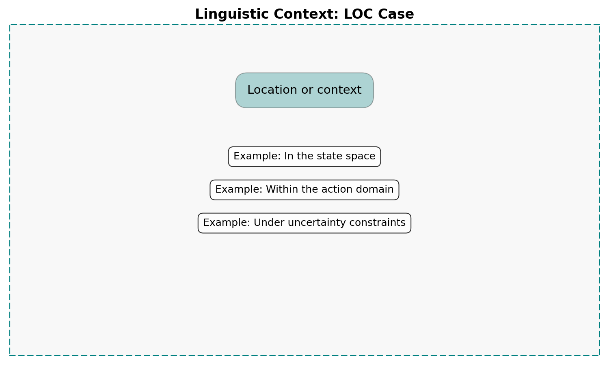
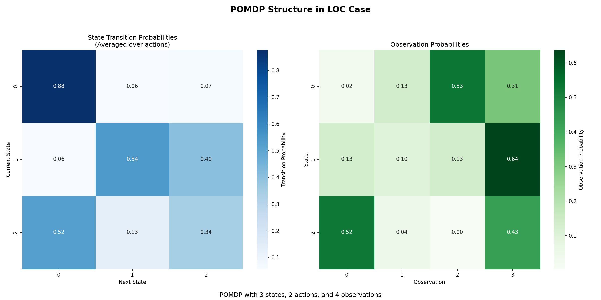
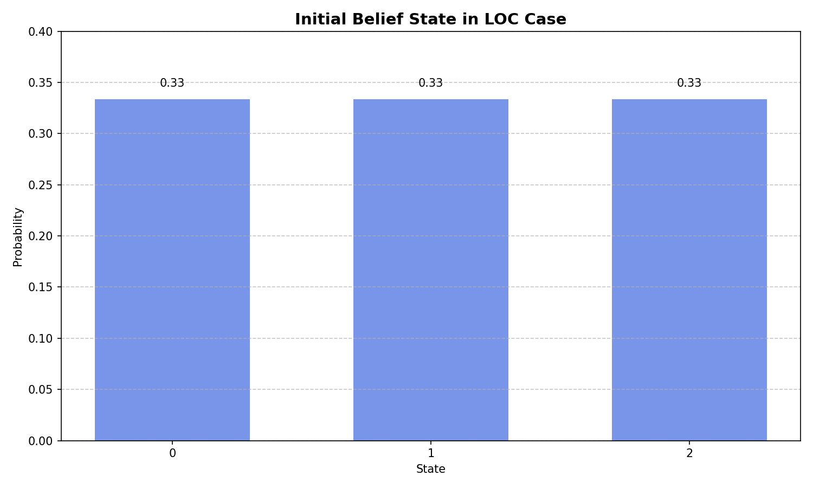
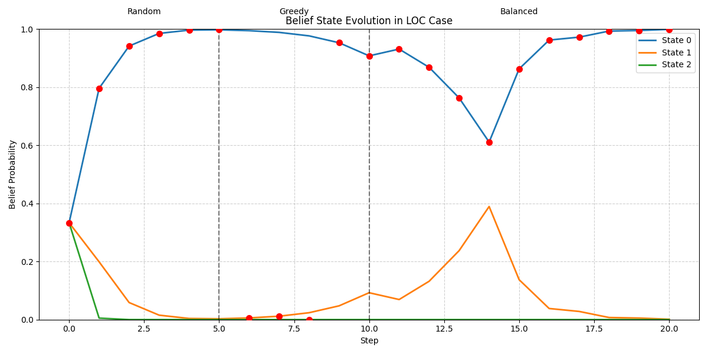
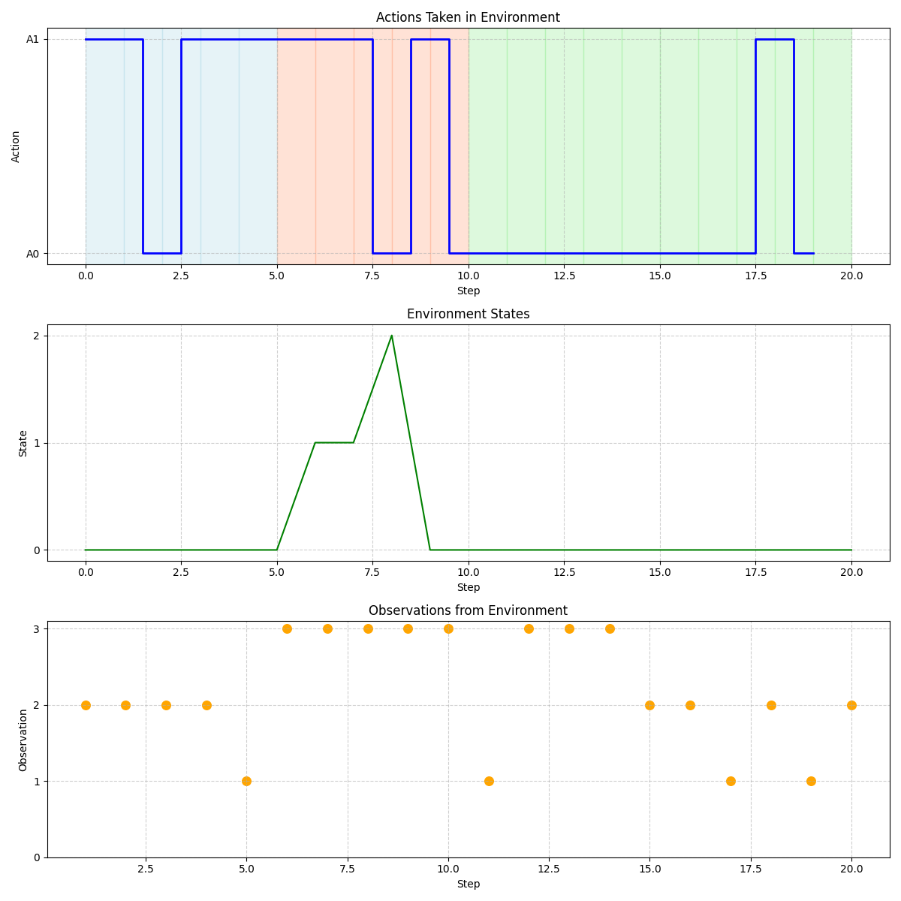
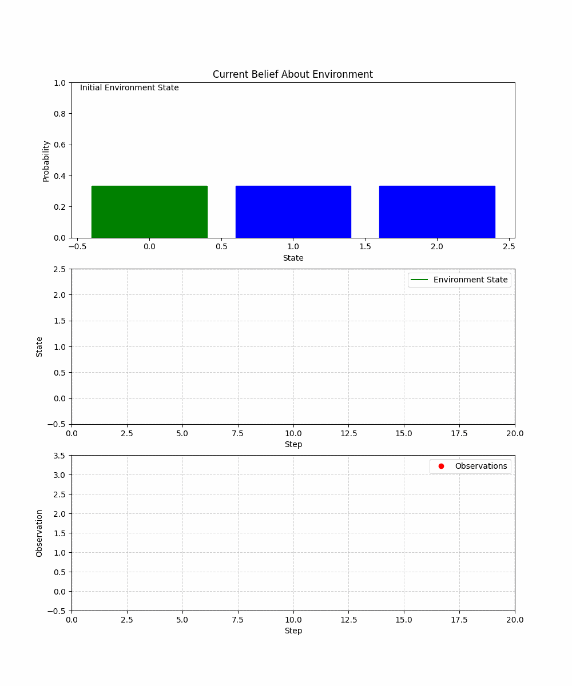

# LOC Case Test Report

## Case Information

- **Linguistic Meaning**: Location or context
- **Statistical Role**: Environment or context
- **POMDP Context**: The POMDP as an environment where agents operate
- **Primary Methods**: get_state(), provide_observation()

## Model Information

- **Model type**: POMDP (Partially Observable Markov Decision Process)
- **Number of states**: 3
- **Number of actions**: 2
- **Number of observations**: 4
- **Case function**: Environmental context where processes occur

## Visualizations

### Linguistic Context

### Pomdp Structure

### Initial Belief

### Belief Evolution

### Environment Visualization

### Environment Exploration

