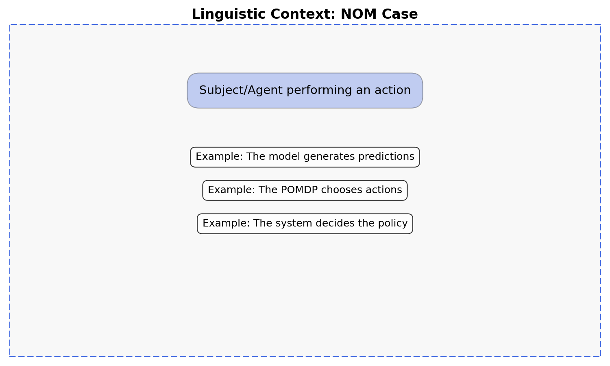
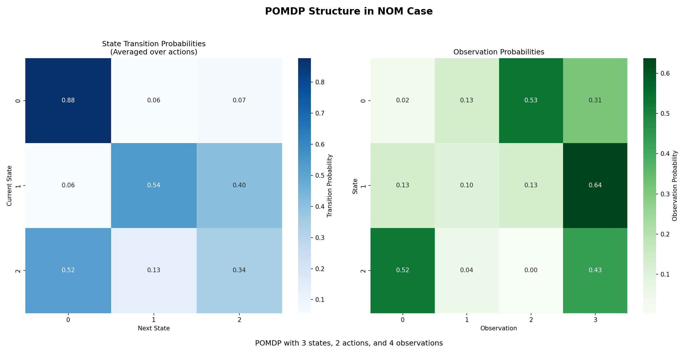
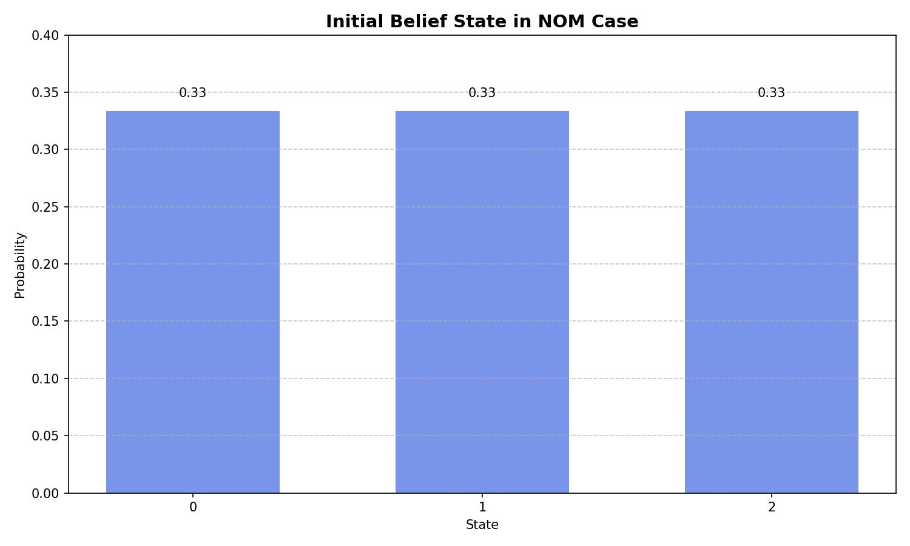
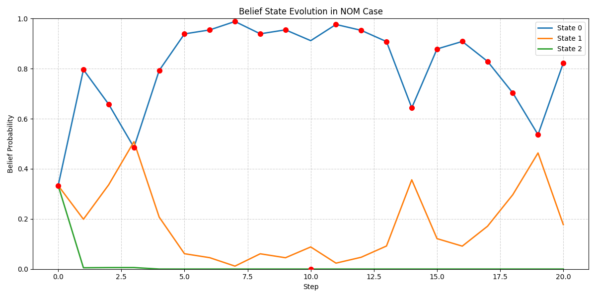
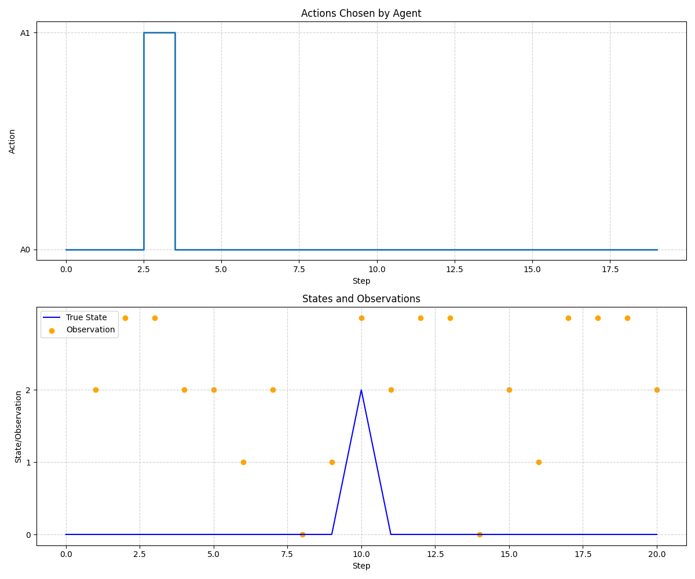
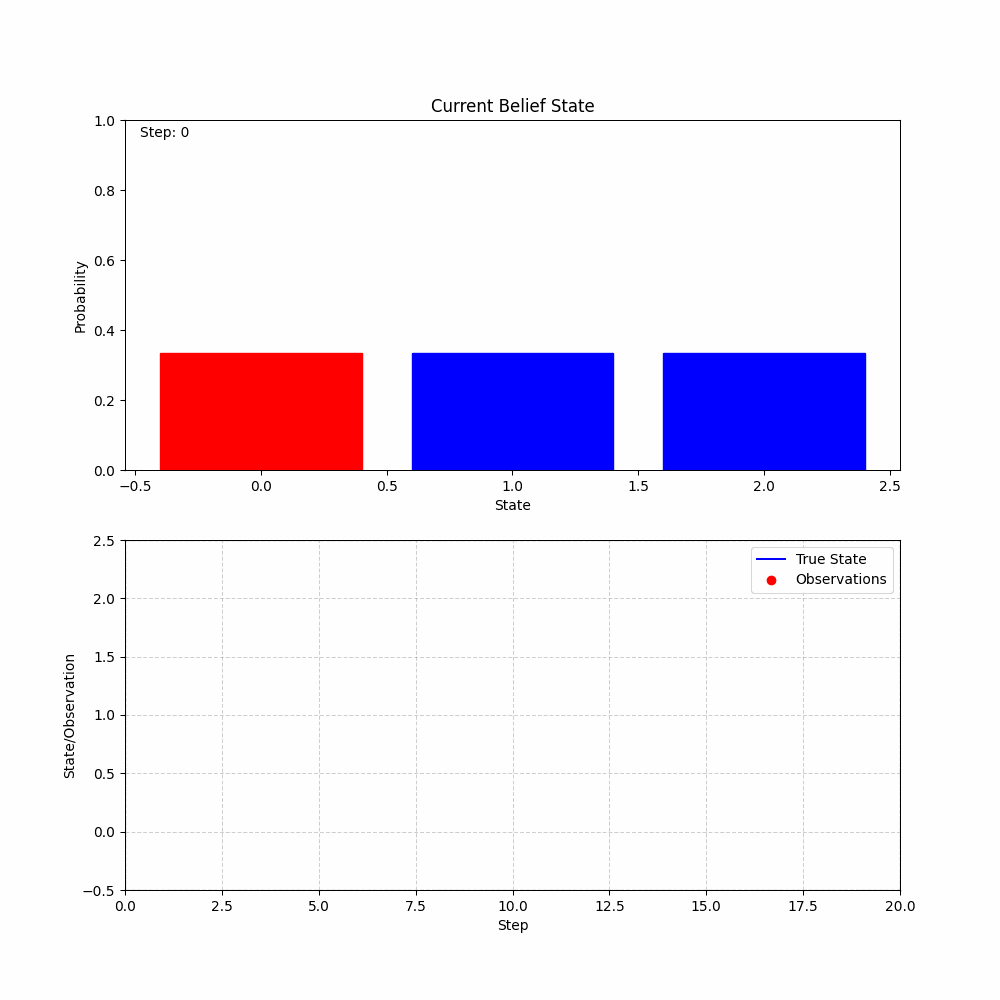

# NOM Case Test Report

## Case Information

- **Linguistic Meaning**: Subject/Doer of action
- **Statistical Role**: Active decision-maker
- **POMDP Context**: The POMDP as an agent actively choosing actions to maximize reward
- **Primary Methods**: get_optimal_action(), transition()

## Model Information

- **Model type**: POMDP (Partially Observable Markov Decision Process)
- **Number of states**: 3
- **Number of actions**: 2
- **Number of observations**: 4
- **Case function**: Active decision-maker generating actions

## Visualizations

### Linguistic Context

### Pomdp Structure

### Initial Belief

### Belief Evolution

### Policy Visualization

### Belief Animation

