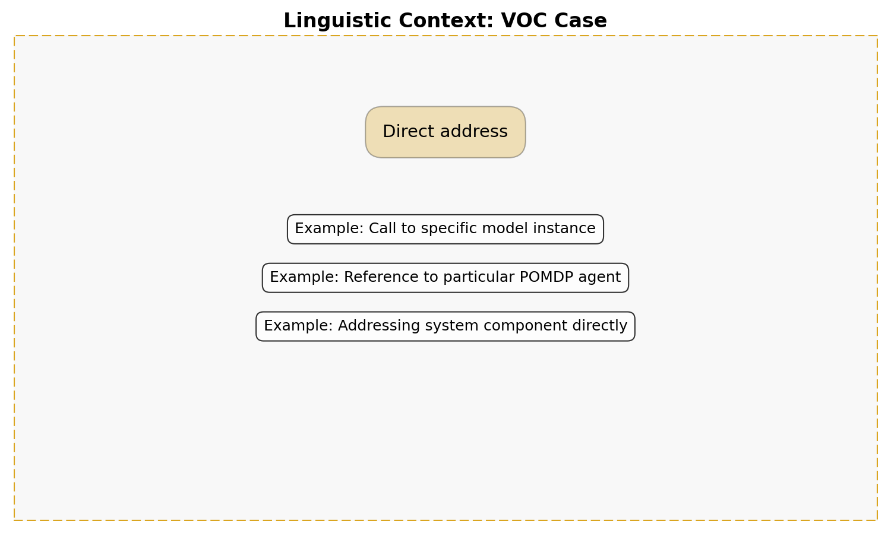
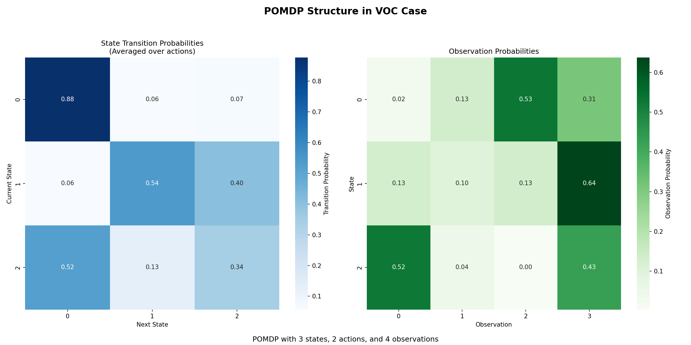
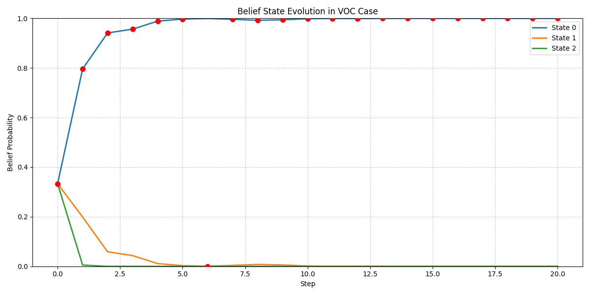
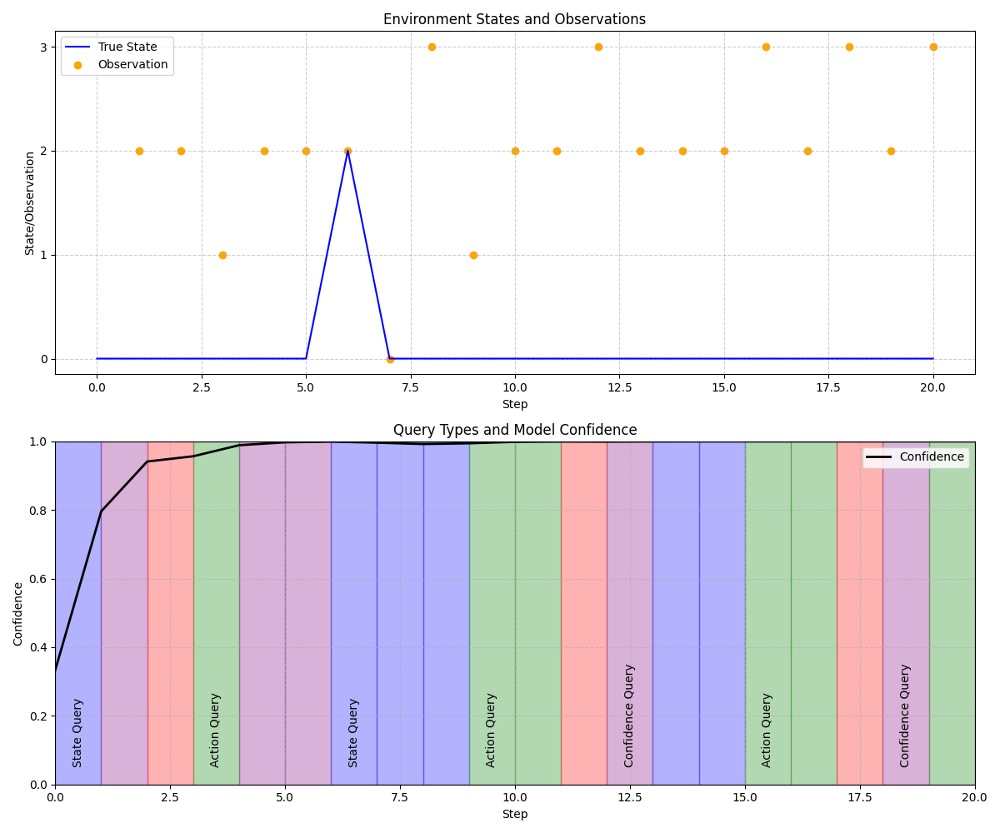
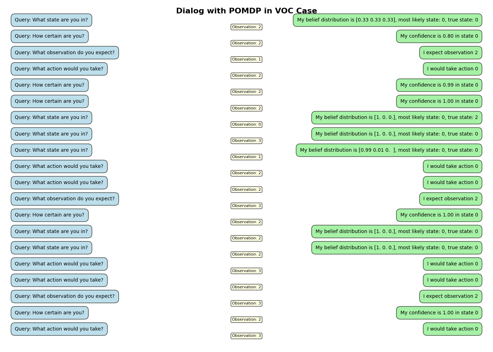
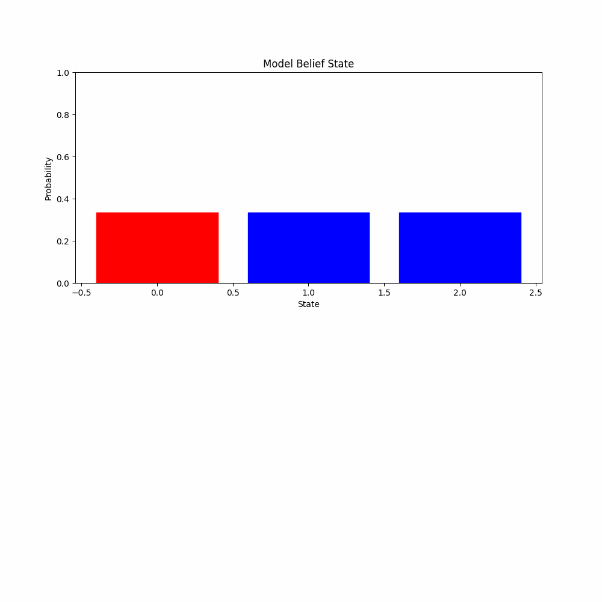

# VOC Case Test Report

## Case Information

- **Linguistic Meaning**: Direct address
- **Statistical Role**: Addressable entity
- **POMDP Context**: The POMDP as an entity that can be queried or invoked directly
- **Primary Methods**: respond_to_query(), answer_prompt()

## Model Information

- **Model type**: POMDP (Partially Observable Markov Decision Process)
- **Number of states**: 3
- **Number of actions**: 2
- **Number of observations**: 4
- **Case function**: Addressable entity that responds to direct queries

## Visualizations

### Linguistic Context

### Pomdp Structure

### Initial Belief

### Belief Evolution

### Interaction History

### Dialog Visualization

### Dialog Animation

