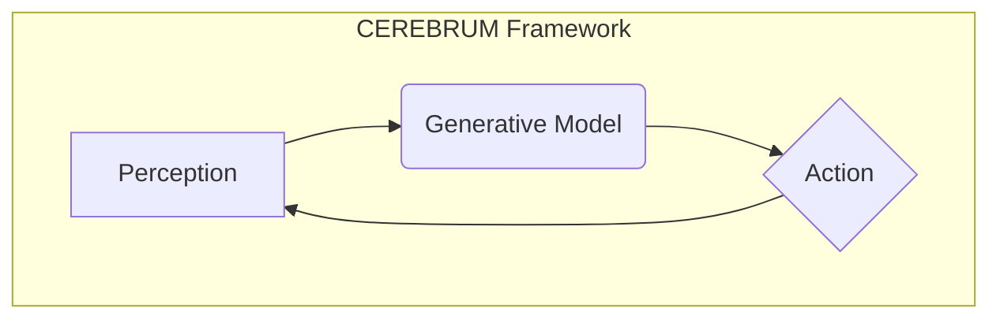

# CEREBRUM Paper Structure & Formatting Guidelines

This document provides guidelines for maintaining consistency in the CEREBRUM paper's structure, formatting, and component integration.

## Directory Structure

```
paper/
├── assemble_paper.py          # Main assembly script
├── README.md                  # This file (guidelines)
├── components/                # All paper components
│   ├── main_text/             # Primary paper sections (numbered)
│   │   ├── 1_title_page.md
│   │   ├── 2_abstract.md
│   │   └── ...                # e.g., 3_introduction.md, etc.
│   ├── figures/               # Figure definitions (Mermaid + caption)
│   │   ├── Figure_1.md
│   │   ├── Figure_2.md
│   │   └── ...
│   ├── supplemental_sections/ # Supplementary material
│   │   ├── Supplement_1_*.md
│   │   ├── Supplement_2_*.md
│   │   └── ...
│   └── templates/             # Templates for new components
│       ├── Figure_template.md
│       ├── Section_template.md
│       ├── Supplement_template.md
│       └── metadata_header.tex # LaTeX header for metadata (used by Pandoc)
└── output/                    # Generated files
    ├── assembled_paper.md     # Combined markdown (processed)
    ├── assembled_paper.html   # HTML version (with ToC)
    ├── assembled_paper.pdf    # PDF version (with ToC, via XeLaTeX)
    ├── Figure_1.png           # Rendered figures
    └── ...                    # e.g., Figure_2.png, etc.
```

## Building the Paper

The paper is built using the `paper/assemble_paper.py` script. Run this command from the root directory of the CEREBRUM repository:

```bash
python3 paper/assemble_paper.py
```

The script performs the following steps:

1.  **Render Mermaid Figures**: Finds `Figure_*.md` files in `paper/components/figures/`, extracts the Mermaid code within ` ```mermaid ... ``` ` blocks, and renders them to `Figure_*.png` images in the `paper/output/` directory using the Mermaid CLI (`mmdc`).
2.  **Assemble Markdown**:
    *   Finds and sorts main text components (`[number]_*.md`) from `paper/components/main_text/`.
    *   Finds and sorts supplemental components (`Supplement_[number]_*.md`) from `paper/components/supplemental_sections/`.
    *   Extracts figure captions from the `Figure_*.md` definition files.
    *   Maps figure references (like `{#fig:figX}`) to their sequential appearance order in the combined document.
    *   Processes the content of each component file:
        *   Replaces simple references like `@fig:figX` with `Figure Y` (where Y is the sequential number).
        *   Replaces Pandoc-style figure tags like `{#fig:figY}` with ``, using the sequential number (Y) and the caption extracted from `Figure_X.md`.
    *   Combines the processed main text and supplemental sections (adding page breaks between supplements) into `paper/output/assembled_paper.md`.
3.  **Convert to HTML**: Uses Pandoc to convert `assembled_paper.md` to `paper/output/assembled_paper.html`, adding a table of contents (`--toc`).
4.  **Convert to PDF**: Uses Pandoc with the XeLaTeX engine (`--pdf-engine=xelatex`) to convert `assembled_paper.md` to `paper/output/assembled_paper.pdf`, also adding a table of contents (`--toc`).

All output files are placed in the `paper/output/` directory.

### Prerequisites

To build the paper, you need:

- Python 3 (with standard libraries like `os`, `glob`, `re`, `logging`)
- Node.js with Mermaid CLI (`@mermaid-js/mermaid-cli` package installed globally or accessible via `mmdc` command)
- Pandoc
- XeLaTeX (a LaTeX distribution like TeX Live or MiKTeX is required for PDF generation)

### Building the Paper (Command Summary)

```bash
# Ensure you are in the CEREBRUM repository root
python3 paper/assemble_paper.py
```

The script will log its progress to the console. Check the `paper/output/` directory for the final `assembled_paper.html` and `assembled_paper.pdf` files.

## Component Naming Conventions

### Main Text Files

Name main text files with numeric prefixes to enforce ordering:
- `1_title_page.md`
- `2_abstract.md`
- `3_introduction.md`
- etc.

### Figure Files

Name figure files consistently:
- `Figure_1.md` (containing Mermaid code)
- `Figure_2.md`
- etc.

### Supplemental Sections

Name supplemental sections with clear numeric prefixes:
- `Supplement_1_Mathematical_Formalization.md`
- `Supplement_2_Novel_Linguistic_Cases.md`
- etc.

## Figure Management

### Figure Definition (in `components/figures/`)

Each figure should be defined in its own Markdown file within `paper/components/figures/`. The file should contain:
1.  A Mermaid diagram definition enclosed in ```mermaid ... ```.
2.  Optionally, a paragraph following the Mermaid block which will be used as the figure caption. The script will attempt to extract this paragraph.

Example (`Figure_1.md`):
```md


This diagram illustrates the core components of the CEREBRUM framework, showing the cyclical relationship between perception, the generative model, and action selection.
```
*(Note: The paragraph above will be extracted as the caption for Figure 1)*

### Figure References (in main text and supplements)

When writing your text components (`main_text/` or `supplemental_sections/`), reference figures using **pandoc-crossref syntax initially**:

1.  **In-text reference**: Use `@fig:figX` (e.g., `As shown in @fig:fig1...`).
2.  **Figure placement tag**: Use `{#fig:figX}`.
    *   Replace `X` with the *number from the figure filename* (e.g., `Figure_1.png`).
    *   Replace `Y` with a *unique identifier number* for the reference (e.g., `#fig:fig1`). This number establishes the *intended* order but will be replaced by the script.
    *   The alt text (`Optional alt text.`) is **not** used for the final caption. The caption is taken from the `Figure_X.md` file.

**How the Assembly Script Processes References:**

During the build process (`assemble_paper.py`):
1.  The script renders `Figure_X.md` to `output/Figure_X.png`.
2.  It determines the *sequential order* of all figure placement tags (`{#fig:...}`) throughout the document. Let's call the sequence number `S`.
3.  It extracts the caption text from the corresponding `paper/components/figures/Figure_X.md` file.
4.  It replaces the in-text reference `@fig:figY` with `Figure S`.
5.  It replaces the figure placement tag `{#fig:figY}` with the final Pandoc image syntax: ``.

**Key points:**
- Use the correct `Figure_X.png` filename in the placement tag.
- Use unique `#fig:figY` labels.
- The script handles the final numbering (`Figure S`) and caption insertion based on the `Figure_X.md` file and appearance order.
- Do **not** include "Figure X:" prefixes in the caption paragraph within `Figure_X.md`.

### Figure Placement

Place the figure placement tag `{#fig:figY}` in your markdown file where you want the figure to appear, typically after its first mention in the text via `@fig:figY`.

## Sections and Headers

- Use ATX-style headers (`#`, `##`, `###`, etc.)
- Main section titles use `##` (level 2)
- Subsections use `###` (level 3)
- Avoid skipping levels
- Title page uses a single `#` (level 1) for the document title

## Tables

Format tables using standard Markdown table syntax:

```md
**Table 1: Example Table Title**
| Column 1 | Column 2 | Column 3 |
|----------|----------|----------|
| Data 1   | Data 2   | Data 3   |
| Data 4   | Data 5   | Data 6   |
```

## Equations and Math

Use LaTeX syntax for equations:

- Inline math: `$E = mc^2$`
- Display math: 
  ```
  $$
  F = D_{KL}[q(s|T(m))||p(s|m)] - \mathbb{E}_{p}[\log p(o|s,T(m))]
  $$
  ```
- For numbered equations, use the `\tag{}` command:
  ```
  $$
  F = D_{KL}[q(s|T(m))||p(s|m)] - \mathbb{E}_{p}[\log p(o|s,T(m))]  \tag{1}
  $$
  ```

## Cross-References

- Figures: `@fig:figX` (e.g., `@fig:fig1`)
- Equations: Can be referenced by their tag number: "As shown in equation (1)"
- Sections: No automatic numbering; reference by name

## Assembly Process

The paper is assembled by the `assemble_paper.py` script, which orchestrates the following:

1.  **Mermaid Rendering**: Converts `.md` files containing Mermaid code in `components/figures/` into `.png` images in the `output/` directory.
2.  **Component Collection**: Gathers main text (`components/main_text/`) and supplemental (`components/supplemental_sections/`) markdown files.
3.  **Figure Processing**:
    *   Extracts captions from `components/figures/Figure_*.md` files.
    *   Determines the sequential order of figure references (`{#fig:...}`) across all components.
    *   Rewrites figure references (`@fig:...`) and placement tags (`![...]...{#fig:...}`) in the component text to use sequential numbering and include the extracted captions.
4.  **Markdown Concatenation**: Combines the processed markdown content from main text and supplements (adding page breaks before/between supplements) into a single `output/assembled_paper.md` file.
5.  **Output Conversion**: Uses Pandoc to convert the `assembled_paper.md` into:
    *   `output/assembled_paper.html` (with Table of Contents)
    *   `output/assembled_paper.pdf` (using XeLaTeX, with Table of Contents)

To build the paper, simply run the script from the repository root:

```bash
python3 paper/assemble_paper.py
```

## Pandoc Details

The `assemble_paper.py` script uses Pandoc for the final conversion steps. Key aspects include:

- **HTML Output**: Generates a standalone HTML file with a Table of Contents (`--toc --standalone`).
- **PDF Output**: Uses the XeLaTeX engine (`--pdf-engine=xelatex`) for high-quality PDF generation, enabling broader font support. Requires a working LaTeX installation (like TeX Live or MiKTeX). Also includes a Table of Contents (`--toc`) and basic margin/font styling.
- **Figure Handling**: The script pre-processes figure references and captions *before* Pandoc runs, so extensions like `pandoc-crossref` are **not** needed for the final conversion stage. Pandoc simply includes the images using the standard markdown `` syntax generated by the script.
- **Metadata**: Basic metadata (like title) is passed via command-line arguments. More complex metadata could potentially be managed via a YAML block or the `metadata_header.tex` file if integrated into the Pandoc command.

## Content Guidelines

- Maintain consistent terminology throughout
- Use descriptive figure captions that stand alone
- Ensure all figures are referenced in the text before they appear
- Avoid placeholder text
- Include proper citations where applicable
- Maintain section balance and flow

## Available Cases

When referring to cases in the text, use the standard abbreviations:

- **[NOM]** - Nominative
- **[ACC]** - Accusative
- **[DAT]** - Dative
- **[GEN]** - Genitive
- **[INS]** - Instrumental
- **[LOC]** - Locative
- **[ABL]** - Ablative
- **[VOC]** - Vocative

## Using Templates for New Components

Templates are provided for creating new components with consistent formatting:

1. **Figure Template** (`components/templates/Figure_template.md`):
   - Copy this template when creating a new figure
   - Update the figure number and title
   - Replace the placeholder Mermaid code with your diagram

2. **Section Template** (`components/templates/Section_template.md`):
   - Use this template when adding a new main text section
   - Provides structure for sections, subsections, figures, tables, and equations
   - Save with appropriate numeric prefix in `components/main_text/`

3. **Supplement Template** (`components/templates/Supplement_template.md`):
   - Template for creating new supplemental sections
   - Includes standard sections and formatting for supplements
   - Save with appropriate naming (e.g., `Supplement_X_Descriptive_Title.md`) in `components/supplemental_sections/`

4. **LaTeX Header** (`components/templates/metadata_header.tex`):
   - Contains LaTeX preamble commands, potentially for metadata, custom packages, or styling used during PDF generation via Pandoc. (Note: The current script passes basic metadata via command line).

## Schema Extension

When adding new components:

1. For new main text sections:
   - Copy the Section template from `paper/components/templates/`
   - Add to `paper/components/main_text/` with appropriate numeric prefix
   - Ensure headers use correct levels (starting with `##`)

2. For new figures:
   - Copy the Figure template from `paper/components/templates/`
   - Add figure definition to `paper/components/figures/`
   - Reference properly in main text

3. For new supplements:
   - Copy the Supplement template from `paper/components/templates/`
   - Add to `paper/components/supplemental_sections/`
   - Use consistent naming convention 