# Figure 1: Foundation Domains of CEREBRUM

```mermaid
flowchart TB    
    subgraph Foundations["🏛️ Foundation Domains"]
        direction TB
        CSM["🧠 Cognitive Systems Modeling<br><small>Entities with flexible roles</small>"]
        AI["🔄 Active Inference<br><small>Predictive processing mechanics</small>"]
        LCS["🔤 Linguistic Case Systems<br><small>Grammatical relationship framework</small>"]
        IP["📊 Intelligence Production<br><small>Practical application context</small>"]
    end
    
    CORE["🧩 CEREBRUM<br><small>Case-Enabled Reasoning Engine with<br>Bayesian Representations for Unified Modeling</small>"]
    
    subgraph Components["⚙️ Framework Components"]
        direction TB
        FUNC["🔗 Functional Relationships<br><small>Case-based model interactions</small>"]
        PROC["⚡ Process Dynamics<br><small>Transformation mechanics</small>"]
    end
    
    subgraph Outcomes["🎯 System Outcomes"]
        direction TB
        REPR["📐 Structured Representation<br><small>Formal model relationships</small>"]
        OPT["⚡ Optimized Workflows<br><small>Efficient process sequences</small>"]
        VALID["✓ Mathematical Validity<br><small>Category-theoretic guarantees</small>"]
    end
    
    OUTPUT["📈 Enhanced Model Management<br><small>Coherent, efficient, theoretically sound</small>"]
    
    CSM --> |"Provides<br>entities"| CORE
    AI --> |"Supplies<br>mechanics"| CORE
    LCS --> |"Offers<br>structure"| CORE
    IP --> |"Furnishes<br>context"| CORE
    
    CORE --> |"Defines"| FUNC
    CORE --> |"Enables"| PROC
    
    FUNC --> |"Creates"| REPR
    PROC --> |"Produces"| OPT
    FUNC --> |"Ensures"| VALID
    PROC --> |"Maintains"| VALID
    
    REPR --> |"Improves<br>coherence"| OUTPUT
    OPT --> |"Enhances<br>efficiency"| OUTPUT
    VALID --> |"Strengthens<br>foundation"| OUTPUT
    
    %% Enhanced styling
    classDef foundation fill:#f9f9ff,stroke:#9999ff,stroke-width:2px,color:#000066
    classDef core fill:#fffef0,stroke:#ffcc00,stroke-width:3px,color:#663300
    classDef component fill:#f0fff0,stroke:#99cc99,stroke-width:2px,color:#006600
    classDef outcome fill:#fff0f0,stroke:#ffaaaa,stroke-width:2px,color:#660000
    classDef output fill:#f0f8ff,stroke:#99ccff,stroke-width:3px,color:#000066
    
    class Foundations foundation
    class CORE core
    class Components component
    class Outcomes outcome
    class OUTPUT output
    class CSM,AI,LCS,IP foundation
    class FUNC,PROC component
    class REPR,OPT,VALID outcome
```

Figure 1. Foundation Domains of CEREBRUM. This diagram illustrates the conceptual architecture of the CEREBRUM framework, showing how four distinct domains converge to create a unified approach to model management. Cognitive Systems Modeling provides the entities that assume case relationships; Active Inference supplies the predictive processing mechanics driving case transformations; Linguistic Case Systems offer the grammatical framework for model relationships; and Intelligence Production provides the practical application context. These foundation domains integrate within CEREBRUM to produce framework components (functional relationships and process dynamics), which in turn yield system outcomes (structured representation, optimized workflows, and mathematical validity). The ultimate output is enhanced model management with improved coherence, efficiency, and theoretical soundness. This integration creates a framework that bridges theoretical linguistics, cognitive science, and practical intelligence applications.