# Figure 10: Computational Implementation of Model Relationships

```mermaid
flowchart TD
    %% Title with description
    title["Computational Architecture for Case-Based Model Relationships"]

    subgraph Implementation["System Implementation Architecture"]
        direction TB
        
        subgraph ResourceAllocation["Resource Allocation Patterns"]
            direction TB
            CPU["CPU Allocation<br><small>Processing power distribution</small><br><small>• [NOM] models get highest priority</small><br><small>• [INS] models get dedicated threads</small>"]
            MEM["Memory Management<br><small>State and parameter storage</small><br><small>• [GEN] models get expanded buffers</small><br><small>• [ACC] models get parameter caches</small>"]
            NET["Network Bandwidth<br><small>Inter-model communication</small><br><small>• [DAT] models get priority channels</small><br><small>• [VOC] models get reserved bandwidth</small>"]
            IO["Storage Management<br><small>Persistence and retrieval</small><br><small>• [ABL] models get history tracking</small><br><small>• [LOC] models get context storage</small>"]
        end
        
        subgraph MessagePassing["Message Passing Architecture"]
            direction TB
            ASYNC["Asynchronous Messaging<br><small>Non-blocking communication</small><br><small>• Event-driven case transitions</small><br><small>• Parallel transformation execution</small>"]
            SYNC["Synchronous Messaging<br><small>Blocking communication</small><br><small>• Critical path case sequences</small><br><small>• Transaction integrity checks</small>"]
            BATCH["Batch Processing<br><small>Efficient bulk operations</small><br><small>• Grouped case transformations</small><br><small>• Multi-model state updates</small>"]
            STREAM["Stream Processing<br><small>Real-time data flow</small><br><small>• Continuous case monitoring</small><br><small>• Dynamic role reassignment</small>"]
        end
        
        subgraph Transformation["Transformation Optimization"]
            direction TB
            PARALLEL["Parallel Processing<br><small>Concurrent transformations</small><br><small>• Multi-model case transitions</small><br><small>• Distributed transformation loads</small>"]
            PIPELINE["Pipeline Processing<br><small>Sequential transformations</small><br><small>• Ordered case transitions</small><br><small>• Dependency-aware scheduling</small>"]
            CACHING["Cached Transformations<br><small>Reuse of common results</small><br><small>• Frequent case pattern caching</small><br><small>• Transformation template library</small>"]
            LAZY["Lazy Evaluation<br><small>On-demand computation</small><br><small>• Deferred case transitions</small><br><small>• Just-in-time role assignment</small>"]
        end
        
        subgraph Monitoring["System Monitoring & Management"]
            direction TB
            METRICS["Performance Metrics<br><small>Resource utilization</small><br><small>• Case-specific performance tracking</small><br><small>• Transformation efficiency analysis</small>"]
            LOGS["System Logs<br><small>Operation tracking</small><br><small>• Case transition history</small><br><small>• Model lifecycle documentation</small>"]
            ALERTS["Alert System<br><small>Anomaly detection</small><br><small>• Illegal case transitions</small><br><small>• Resource constraint violations</small>"]
            DASH["Management Dashboard<br><small>Real-time monitoring</small><br><small>• Visual case state monitoring</small><br><small>• Interactive system control</small>"]
        end
    end
    
    %% Case-specific implementation notes
    subgraph CaseOptimization["Case-Specific Implementation Optimizations"]
        direction TB
        NOM_OPT["[NOM] Case Optimizations<br><small>• Priority thread allocation</small><br><small>• Expanded prediction cache</small><br><small>• Proactive resource reservation</small>"]
        ACC_OPT["[ACC] Case Optimizations<br><small>• Enhanced parameter storage</small><br><small>• Optimized update channels</small><br><small>• Gradient computation acceleration</small>"]
        DAT_OPT["[DAT] Case Optimizations<br><small>• Input buffer prioritization</small><br><small>• Stream processing optimization</small><br><small>• Data validation acceleration</small>"]
        GEN_OPT["[GEN] Case Optimizations<br><small>• Output pipeline optimization</small><br><small>• Enhanced rendering resources</small><br><small>• Product generation templates</small>"]
    end
    
    %% Connect components with relationship descriptions
    ResourceAllocation -->|"Provides resources for"| MessagePassing
    MessagePassing -->|"Enables"| Transformation
    Transformation -->|"Reports to"| Monitoring
    Monitoring -->|"Adjusts"| ResourceAllocation
    
    CaseOptimization -.->|"Informs"| ResourceAllocation
    CaseOptimization -.->|"Configures"| MessagePassing
    CaseOptimization -.->|"Guides"| Transformation
    
    %% Enhanced styling with better accessibility
    classDef title fill:none,stroke:none,color:#000066,font-size:18px,font-weight:bold
    classDef resource fill:#E6F3FF,stroke:#326CE5,stroke-width:2px,color:#000066,font-weight:bold
    classDef message fill:#FFF5E6,stroke:#FFB347,stroke-width:2px,color:#663300,font-weight:bold
    classDef transform fill:#F0FFF0,stroke:#99cc99,stroke-width:2px,color:#006600,font-weight:bold
    classDef monitor fill:#FFF0F0,stroke:#ff9999,stroke-width:2px,color:#8B0000,font-weight:bold
    classDef framework fill:#f9f9ff,stroke:#9999ff,stroke-width:3px,color:#000066,font-weight:bold
    classDef optimization fill:#f0e6ff,stroke:#9966cc,stroke-width:2px,color:#660066,font-weight:bold
    
    class title title
    class CPU,MEM,NET,IO resource
    class ASYNC,SYNC,BATCH,STREAM message
    class PARALLEL,PIPELINE,CACHING,LAZY transform
    class METRICS,LOGS,ALERTS,DASH monitor
    class Implementation framework
    class ResourceAllocation,MessagePassing,Transformation,Monitoring resource
    class CaseOptimization,NOM_OPT,ACC_OPT,DAT_OPT,GEN_OPT optimization
```

Figure 10. Computational Implementation of Model Relationships. This diagram illustrates the practical computational architecture required to implement CEREBRUM's case-based model relationships in real-world systems. The implementation encompasses four interconnected components that translate theoretical case transformations into efficient computational processes. Resource Allocation Patterns determine how computational resources (CPU, memory, network bandwidth, and storage) are distributed to models based on their case assignments, with nominative [NOM] models typically receiving higher processing priority while instrumental [INS] models optimize for method execution. The Message Passing Architecture defines communication protocols between case-bearing models, supporting both synchronous and asynchronous interactions, batch processing for efficiency, and stream processing for real-time applications. Transformation Optimization focuses on the efficient execution of case transformations through parallel processing, pipeline optimization, caching of common transformation patterns, and lazy evaluation for on-demand computation. System Monitoring provides observability through performance metrics, logs, alerts, and dashboards, creating a feedback loop to the resource allocation system. The Case-Specific Implementation Optimizations section highlights specialized optimizations for different cases, ensuring that each model role is computationally supported in the most efficient manner. This comprehensive implementation framework ensures that the theoretical foundations of CEREBRUM translate into scalable, efficient computational systems that can manage complex model ecosystems while maintaining the principled case relationships and transformations that define the framework.

