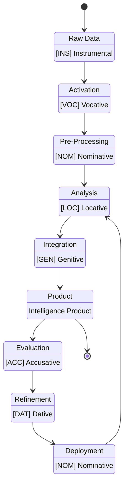

# Figure 11: Intelligence Production Workflow State Diagram

Figure 11. Intelligence Production Workflow State Diagram. This state diagram visualizes the transformation of data into intelligence products through a series of interconnected states. Beginning with raw data collection (Instrumental case [INS]), the process moves through system activation (Vocative case [VOC]), pre-processing (Nominative case [NOM]), analysis (Locative case [LOC]), and integration (Genitive case [GEN]), ultimately producing an intelligence product. The workflow continues with evaluation (Accusative case [ACC]), refinement (Dative case [DAT]), and deployment (Nominative case [NOM]), forming a feedback loop back to the analysis stage. This cyclical structure enables continuous improvement and adaptation of intelligence products based on operational feedback. Each state corresponds to a specific case that defines the role of models within that state, as described in Figure 6. The diagram illustrates how intelligence production is not a linear process but rather an iterative cycle of creation, assessment, and enhancement.

