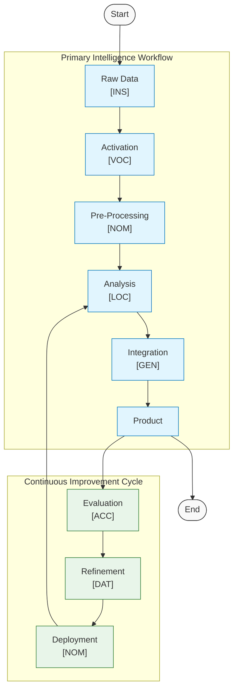

# Figure 12: Intelligence Workflow with Primary and Feedback Cycles

Figure 12. Alternative Visualization of Intelligence Production Workflow. This diagram presents a complementary perspective to Figure 11, organizing the intelligence workflow into two distinct components: the main Intelligence Workflow and a separate Feedback Loop. The main workflow proceeds linearly from raw data collection (using a model in Instrumental case [INS]) through system activation (Vocative case [VOC]), pre-processing (Nominative case [NOM]), analysis (Locative case [LOC]), and integration (Genitive case [GEN]), ultimately producing an intelligence product. The feedback loop component explicitly highlights the cyclical nature of quality improvement, showing how evaluation (Accusative case [ACC]), refinement (Dative case [DAT]), and deployment (Nominative case [NOM]) form a continuous cycle of assessment and enhancement. The diagram demonstrates how the feedback loop connects back to the main workflow, with updates flowing from deployment back to the analysis stage, creating an iterative improvement process. This visualization emphasizes the distinct roles of the primary production pipeline and the quality enhancement cycle, while maintaining the same case assignments for each stage as shown in Figures 6 and 11.

