# Figure 13: Active Inference Integration Framework

```mermaid
flowchart TD
    %% Title with description
    title["Active Inference in CEREBRUM: Predictive Processing Framework"]

    subgraph AIFRAMEWORK["Active Inference Framework"]
        direction TB
        
        subgraph ProcessingLayers["Hierarchical Processing Layers"]
            direction TB
            GM["Generative Model [NOM]<br>Prior beliefs; internal model<br><small>• Maintains predictive world model</small><br><small>• Top-down prediction generator</small><br><small>• Controls precision weighting</small>"]
            SE["Sensory Evidence [DAT]<br>Observed data; measurements<br><small>• Receives external information</small><br><small>• Computes prediction errors</small><br><small>• Signals surprising observations</small>"]
            UM["Updated Model [GEN]<br>Posterior distribution<br><small>• Produces updated beliefs</small><br><small>• Generates new parameters</small><br><small>• Sources model improvements</small>"]
            AM["Active Model [INS]<br>Action selection policy<br><small>• Implements action selection</small><br><small>• Executes model functions</small><br><small>• Tools for environment interaction</small>"]
            W["World State<br>External reality<br><small>• Environmental conditions</small><br><small>• Actual system state</small><br><small>• Ground truth</small>"]
            
            %% Bidirectional prediction-error flows with labeled edges
            GM -->|"Top-down predictions<br>(Expected observations)"| SE
            SE -->|"Bottom-up errors<br>(Prediction violations)"| GM
            
            %% Generative model update cycle
            GM -->|"Posterior<br>update"| UM
            UM -->|"Action<br>selection"| AM
            AM -->|"Environmental<br>interaction"| W
            W -->|"New sensory<br>evidence"| SE
        end
        
        subgraph FreeEnergy["Free Energy Minimization"]
            direction TB
            FE["Free Energy Function<br>F = D<sub>KL</sub>(q(s)||p(s|o)) - E<sub>q</sub>[log p(o)]<br><small>• Divergence between approximate and true posterior</small><br><small>• Expected log model evidence</small>"]
            SURPRISE["Surprise Minimization<br>min -log p(o)<br><small>• Reducing prediction errors</small><br><small>• Updating internal model</small><br><small>• Seeking expected states</small>"]
            PRECISION["Precision Weighting<br>π = 1/σ²<br><small>• Uncertainty-based attention</small><br><small>• Confidence in predictions</small><br><small>• Adaptive learning rates</small>"]
            
            %% Show minimization relationships
            FE -->|"Minimized<br>through"| SURPRISE
            SURPRISE -->|"Modulated<br>by"| PRECISION
        end
        
        subgraph CaseMapping["Case-Active Inference Mapping"]
            direction TB
            MAP1["Nominative [NOM]<br><small>• Prediction generation</small><br><small>• Prior belief maintenance</small><br><small>• Active model control</small>"]
            MAP2["Accusative [ACC]<br><small>• Object of prediction</small><br><small>• Parameter update target</small><br><small>• Verification subject</small>"]
            MAP3["Dative [DAT]<br><small>• Signal reception</small><br><small>• Data destination</small><br><small>• Information recipient</small>"]
            MAP4["Genitive [GEN]<br><small>• Update source</small><br><small>• Posterior generator</small><br><small>• Model improvement origin</small>"]
            MAP5["Instrumental [INS]<br><small>• Action execution</small><br><small>• Method implementation</small><br><small>• Tool function</small>"]
            MAP6["Locative [LOC]<br><small>• Context precision</small><br><small>• Environmental parameters</small><br><small>• Situational boundaries</small>"]
            MAP7["Ablative [ABL]<br><small>• Prior knowledge source</small><br><small>• Causal attribution</small><br><small>• Historical reference</small>"]
            MAP8["Vocative [VOC]<br><small>• Direct addressing</small><br><small>• Model activation</small><br><small>• Named reference point</small>"]
            
            %% Connect case mappings to show relationships
            MAP1 --- MAP2 --- MAP3 --- MAP4
            MAP5 --- MAP6 --- MAP7 --- MAP8
        end
        
        %% Show relationships between framework components
        ProcessingLayers -->|"Implements<br>mechanics of"| FreeEnergy 
        FreeEnergy -->|"Provides mathematical<br>foundation for"| CaseMapping
        CaseMapping -.->|"Informs roles in"| ProcessingLayers
    end
    
    %% Enhanced styling with better accessibility
    classDef title fill:none,stroke:none,color:#000066,font-size:18px,font-weight:bold
    classDef framework fill:#f0f8ff,stroke:#4682b4,stroke-width:3px,color:#000066,font-weight:bold
    classDef process fill:#e6f3ff,stroke:#326ce5,stroke-width:2px,color:#000066
    classDef energy fill:#fff5e6,stroke:#ffb347,stroke-width:2px,color:#663300
    classDef mapping fill:#f0fff0,stroke:#99cc99,stroke-width:2px,color:#006600
    classDef state fill:#ffe6e6,stroke:#ff9999,stroke-width:2px,color:#8B0000
    classDef flow fill:none,stroke:#666,stroke-width:1px,color:#333333
    
    class title title
    class AIFRAMEWORK framework
    class ProcessingLayers process
    class FreeEnergy energy
    class CaseMapping mapping
    class GM,SE,UM,AM,W state
    class FE,SURPRISE,PRECISION energy
    class MAP1,MAP2,MAP3,MAP4,MAP5,MAP6,MAP7,MAP8 mapping
```

Figure 13. Active Inference Integration Framework. This diagram illustrates how CEREBRUM integrates with active inference principles, showing the mapping between case assignments and predictive processing mechanisms. The framework is organized into three interconnected components. The Processing Hierarchy demonstrates the core active inference cycle: a generative model in Nominative case [NOM] sends top-down predictions to sensory evidence in Dative case [DAT], which returns bottom-up prediction errors; this bidirectional message passing leads to an updated model in Genitive case [GEN] (posterior distribution) that informs an active model in Instrumental case [INS] (action selection policy), which then affects the world state, completing the perception-action cycle. The Free Energy Components section formalizes the mathematical principles driving this process: free energy (the sum of divergence between approximate and true posterior, minus expected log evidence) is minimized through surprise reduction and precision weighting. The Case-Active Inference Mapping explicitly connects each linguistic case to its role in the active inference framework, showing how Nominative case handles prediction generation, Accusative becomes the object of prediction, Dative receives signals, and so on. This integration demonstrates how CEREBRUM's case transformations can be understood as free energy minimization processes, providing a principled mathematical foundation for model interactions and transformations within the framework. By framing case assignments in terms of active inference, CEREBRUM leverages established Bayesian mechanics to optimize model behavior across different functional roles.

