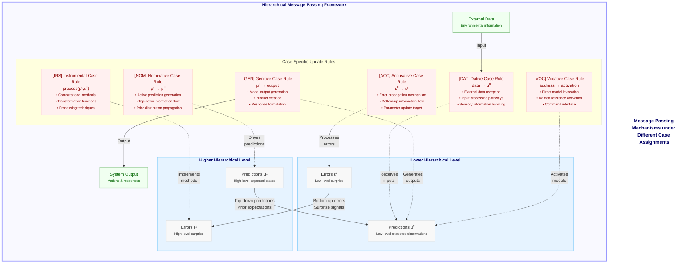

# Figure 14: Case-Specific Message Passing in Active Inference

Figure 14. Case-Specific Message Passing in Active Inference. This diagram details the specific message passing mechanisms that implement case transformations within CEREBRUM's active inference framework. The central component shows the hierarchical bidirectional message passing that characterizes active inference, with top-down predictions (μ¹) flowing from higher to lower levels and bottom-up prediction errors (ε⁰) propagating from lower to higher levels. The Case Rules section specifies how each case modulates these message flows: Nominative case [NOM] governs top-down prediction generation (μ¹ → μ⁰); Accusative case [ACC] handles bottom-up error propagation (ε⁰ → ε¹); Dative case [DAT] manages incoming data reception (data → μ⁰); Genitive case [GEN] controls output generation (μ⁰ → output); Instrumental case [INS] implements processing functions that operate on both predictions and errors (process(μ¹,ε⁰)); and Vocative case [VOC] manages direct activation through addressing (address → activation). These case-specific update rules create a functional specialization while maintaining the core active inference principles of prediction error minimization. By formalizing message passing in terms of case-specific operations, CEREBRUM provides a precise mathematical framework for implementing case transformations as precision-weighted Bayesian updates within hierarchical generative models. This approach connects linguistic case semantics directly to computational message-passing algorithms, creating a principled foundation for model interactions in complex cognitive systems.

