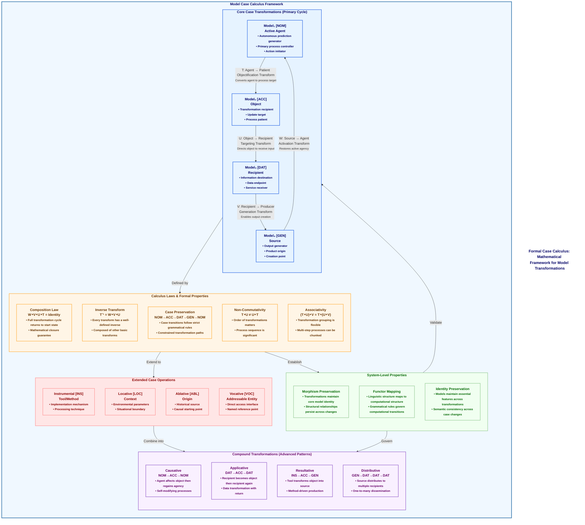

# Figure 15: Model Case Calculus Framework

Figure 15. Model Case Calculus Framework. This diagram presents the formal mathematical calculus underlying CEREBRUM's case transformations, providing a rigorous foundation for modeling dynamic role changes in cognitive systems. The Core Case Transformations section shows the primary cycle between the four main cases: Nominative [NOM] (active agent), Accusative [ACC] (object), Dative [DAT] (recipient), and Genitive [GEN] (source). Each transformation (T, U, V, W) represents a specific morphism that changes a model's functional role while preserving its core identity. The Calculus Laws formalize these transformations mathematically: the Composition Law states that a complete cycle of transformations returns a model to its original state (W∘V∘U∘T = Identity); the Inverse Transform Law defines how to reverse any transformation; and the Case Preservation Law ensures consistent transition paths between cases. The System Properties section highlights mathematical characteristics of the framework: transformations are non-commutative (order matters), associative (grouping is flexible), and identity-preserving (full cycles maintain model identity). The Extended Operations section includes additional cases (Instrumental, Locative, Ablative, Vocative) that expand the framework's expressiveness. Finally, the Compound Transformations section demonstrates how basic transformations can be combined to create complex operations like causative, applicative, and resultative transformations. This formal calculus provides CEREBRUM with mathematical rigor, enabling consistent reasoning about model transitions, verifiable properties, and compositional guarantees in complex model ecosystems. 