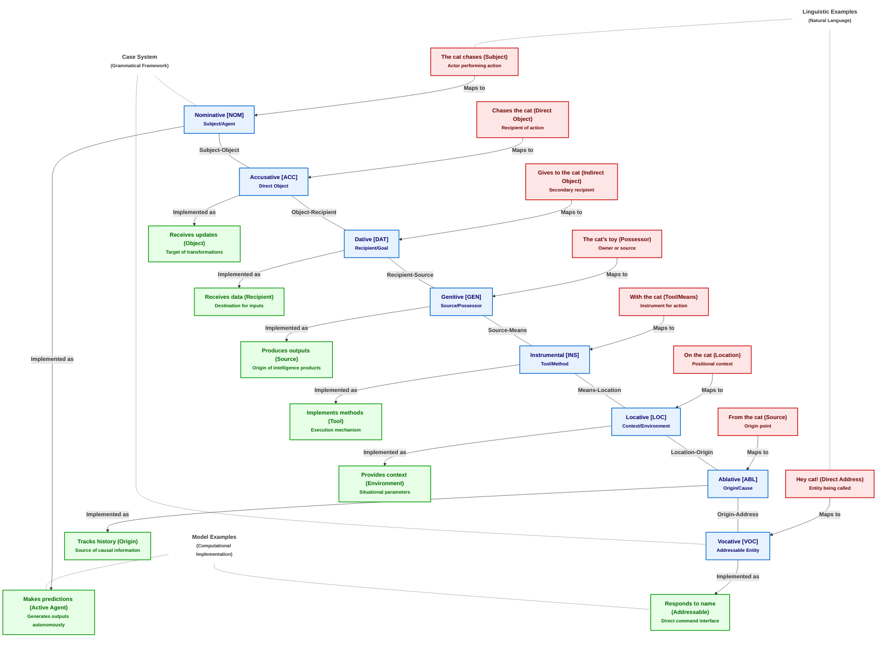

# Figure 2: Case Relationships - Model and Linguistic Parallels

Figure 2. Case Relationships - Model and Linguistic Parallels. This figure illustrates the direct mapping between linguistic case systems and cognitive model relationships in CEREBRUM. The top row presents everyday linguistic examples of each case in English (though English largely expresses cases through word order and prepositions rather than morphological markers). The middle row shows the eight fundamental cases with their standard abbreviations. The bottom row demonstrates how these same case relationships apply to cognitive models within the CEREBRUM framework. For example, just as "the cat" functions as the subject (Nominative case) in language, a model in Nominative case functions as an active agent making predictions. This systematic parallel between linguistic structure and model relationships provides a principled foundation for understanding how models can assume different functional roles while maintaining their core identity, similar to how a noun retains its meaning while its form changes according to its grammatical function.
