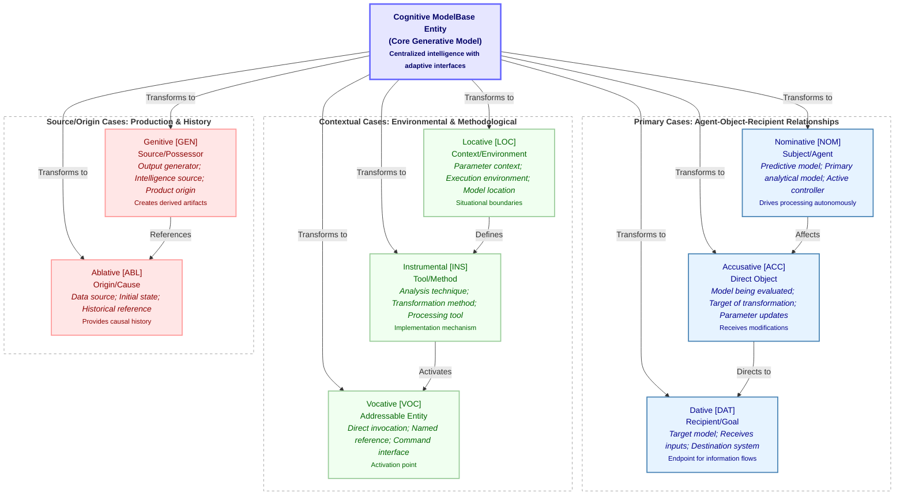

# Figure 3: Cognitive Model Case Framework

Figure 3. Cognitive Model Case Framework. This diagram illustrates how a single core generative model can assume different functional roles through case assignments. At the center lies the core cognitive model entity, which can be transformed into eight distinct case forms, each serving a specific function in the model ecosystem. The cases are organized into three functional groups: Primary Cases (Nominative, Accusative, Dative) handle the main agent-object-recipient relationships in model processing; Contextual Cases (Locative, Instrumental, Vocative) provide environmental, methodological, and interface functions; and Source Cases (Genitive, Ablative) manage output generation and historical attribution. Each case modifies the model's behavior, parameter access patterns, and computational interfaces while maintaining its fundamental identity. For example, when in Nominative case, the model functions as an active agent generating predictions; in Accusative case, it becomes the object of transformations; and in Genitive case, it serves as a source of outputs. This framework enables flexible, context-appropriate model behavior while preserving a coherent identity across transformations.