# Figure 4: Generative Model Integration in Intelligence Case Management

```mermaid
graph TB
    %% Core Generative Model with detailed description
    Core["🧠 Generative Model Core<br>Intelligence Case Manager<br><i>Predictive Processing; Case Transformations; Resource Allocation</i><br><small>Central orchestrator of workflow and resources</small>"]

    %% Intelligence Production Components with case assignments
    subgraph Production["Intelligence Production Cycle"]
        direction LR
        Collection["📥 Data Collection<br><i>[DAT] Input Processing</i><br><i>[LOC] Context Mapping</i><br><small>Gathering and contextualizing information</small>"]
        Analysis["🔍 Analysis<br><i>[NOM] Active Inference</i><br><i>[INS] Method Application</i><br><small>Pattern recognition and evaluation</small>"]
        Synthesis["📊 Synthesis<br><i>[ACC] Model Updates</i><br><i>[GEN] Product Generation</i><br><small>Integration of findings into cohesive products</small>"]
        Dissemination["📤 Dissemination<br><i>[GEN] Report Creation</i><br><i>[ABL] Source Attribution</i><br><i>[VOC] Direct Interface</i><br><small>Distribution of intelligence products</small>"]
    end

    %% Case Management Functions with descriptions
    subgraph Management["Case Management Functions"]
        direction LR
        Tracking["📋 Case Tracking<br><i>Status Monitoring</i><br><i>Progress Updates</i><br><small>Real-time workflow visibility</small>"]
        Workflow["⚡ Workflow Control<br><i>Process Orchestration</i><br><i>Resource Management</i><br><small>Optimized task sequencing</small>"]
        Quality["✓ Quality Assurance<br><i>Validation Checks</i><br><i>Error Minimization</i><br><small>Standards enforcement</small>"]
    end

    %% Connections with labeled relationships
    Core -->|"Orchestrates<br>collection"| Collection
    Core -->|"Directs<br>analysis"| Analysis
    Core -->|"Coordinates<br>synthesis"| Synthesis
    Core -->|"Manages<br>dissemination"| Dissemination
    
    Core -->|"Monitors<br>progress"| Tracking
    Core -->|"Optimizes<br>processes"| Workflow
    Core -->|"Enforces<br>standards"| Quality

    Collection -->|"Provides data for"| Analysis
    Analysis -->|"Feeds insights to"| Synthesis
    Synthesis -->|"Creates products for"| Dissemination

    %% Feedback loops
    Tracking -.->|"Informs"| Core
    Workflow -.->|"Optimizes"| Core
    Quality -.->|"Improves"| Core

    %% Enhanced styling with better contrast
    classDef core fill:#e6e6ff,stroke:#6666ff,stroke-width:3px,color:#000066,font-weight:bold
    classDef production fill:#f0f8ff,stroke:#4682b4,stroke-width:2px,color:#00008B
    classDef management fill:#fff0f0,stroke:#ff9999,stroke-width:2px,color:#8B0000
    classDef group fill:none,stroke:#999,stroke-dasharray: 5 5,color:#333333,font-weight:bold

    class Core core
    class Collection,Analysis,Synthesis,Dissemination production
    class Tracking,Workflow,Quality management
    class Production,Management group
```

Figure 4. Generative Model Integration in Intelligence Case Management. This diagram illustrates how CEREBRUM's generative model core orchestrates both intelligence production and case management functions through case-specific transformations. At the center lies the core generative model that serves as the intelligence case manager, handling predictive processing, case transformations, and resource allocation. The intelligence production cycle (top) consists of four main components: Data Collection (utilizing models in Dative [DAT] and Locative [LOC] cases for input processing and context mapping); Analysis (employing models in Nominative [NOM] and Instrumental [INS] cases for active inference and method application); Synthesis (using models in Accusative [ACC] and Genitive [GEN] cases for model updates and product generation); and Dissemination (leveraging models in Genitive [GEN], Ablative [ABL], and Vocative [VOC] cases for report creation, source attribution, and direct interface). The case management functions (bottom) include Case Tracking for status monitoring, Workflow Control for process orchestration, and Quality Assurance for validation checks and error minimization. This architecture demonstrates how the assignment of specific cases to models enables dynamic role transitions as intelligence products move through the workflow, creating a flexible yet structured approach to intelligence production and management.
