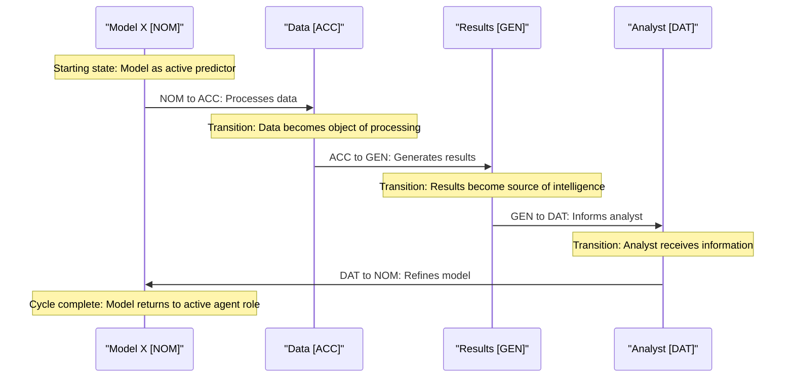

# Figure 5: Model Workflows as Case Transformations - Sequence Diagram 1

Figure 5. Model Workflows as Case Transformations - Sequence Diagram. This diagram illustrates the cyclical nature of case transformations in an intelligence workflow. The sequence begins with Model X in Nominative case [NOM] functioning as an active agent that processes data (in Accusative case [ACC] as the direct object of the operation). The data then transforms to Genitive case [GEN] as it generates results, becoming a source of information. These results move to Dative case [DAT] as they inform the analyst, who serves as the recipient. The cycle completes when the analyst refines the model, transforming from Dative back to Nominative case. Each arrow represents not just a data flow but a functional case transformation, where the entity changes its operational role while maintaining its core identity. This diagram demonstrates how CEREBRUM enables coherent workflows through systematic case transitions, creating a mathematically principled cycle of intelligence production where each component assumes the appropriate functional role at each stage of the process.