# Figure 6: Intelligence Production Workflow with Case-Bearing Models

```mermaid
flowchart LR
    subgraph IntelligenceCycle ["Intelligence Production Workflow"]
        direction LR
        A[Start: Data Collection<br>Model &#40;INS&#41;<br>Gathers raw data<br><small>Tool for information acquisition</small>]
        A2{Activation<br>Model &#40;VOC&#41;<br>Initializes session<br><small>Name-based invocation</small>}
        B{Preprocessing<br>Model &#40;NOM&#41;<br>Cleans & normalizes<br><small>Active transformation agent</small>}
        C{Analysis<br>Model &#40;LOC&#41;<br>Provides context<br><small>Environmental parameters</small>}
        D{Integration<br>Model &#40;GEN&#41;<br>Synthesizes products<br><small>Source of intelligence</small>}
        E{Evaluation<br>Model &#40;ACC&#41;<br>Assesses quality<br><small>Object of verification</small>}
        F{Refinement<br>Model &#40;DAT&#41;<br>Processes feedback<br><small>Recipient of improvements</small>}
        G{Deployment<br>Model &#40;NOM&#41;<br>Implements solution<br><small>Active execution agent</small>}
        H[End: Action/Dissemination<br><small>Final product delivery</small>]
        
        A --> |"Activates process"| A2
        A2 --> |"Pre-processes"| B
        B --> |"Contextualizes"| C
        C --> |"Synthesizes"| D
        D --> |"Evaluates"| E
        E --> |"Improves"| F
        F --> |"Deploys"| G
        G --> |"Completes cycle"| H
        
        %% Feedback loop with explanation
        E --> |"Iterative<br>improvement"| C
        
        %% More descriptive labels
        style A fill:#c6ecc6,stroke:#2d882d,stroke-width:2px,color:#004d00,font-weight:bold
        style H fill:#c6ecc6,stroke:#2d882d,stroke-width:2px,color:#004d00,font-weight:bold
        style A2 fill:#c6e2ff,stroke:#2269a2,stroke-width:2px,color:#00008B,font-weight:bold
        style B fill:#c6e2ff,stroke:#2269a2,stroke-width:2px,color:#00008B,font-weight:bold
        style C fill:#c6e2ff,stroke:#2269a2,stroke-width:2px,color:#00008B,font-weight:bold
        style D fill:#c6e2ff,stroke:#2269a2,stroke-width:2px,color:#00008B,font-weight:bold
        style E fill:#c6e2ff,stroke:#2269a2,stroke-width:2px,color:#00008B,font-weight:bold
        style F fill:#c6e2ff,stroke:#2269a2,stroke-width:2px,color:#00008B,font-weight:bold
        style G fill:#c6e2ff,stroke:#2269a2,stroke-width:2px,color:#00008B,font-weight:bold
    end

    %% Flow explanation
    subgraph Legend["Case Function Legend"]
        direction TB
        NOM["[NOM]: Active Agent<br><small>Performs transformations</small>"]
        ACC["[ACC]: Direct Object<br><small>Receives actions</small>"]
        DAT["[DAT]: Recipient<br><small>Receives data flows</small>"]
        GEN["[GEN]: Source<br><small>Generates outputs</small>"]
        INS["[INS]: Tool<br><small>Implements methods</small>"]
        LOC["[LOC]: Context<br><small>Provides environment</small>"]
        VOC["[VOC]: Addressable<br><small>Responds to invocation</small>"]
    end

    %% Styling
    classDef startend fill:#dff0d8,stroke:#3c763d,stroke-width:2px,color:#2d882d
    classDef process fill:#d9edf7,stroke:#31708f,stroke-width:2px,color:#31708f
    classDef decision fill:#fcf8e3,stroke:#8a6d3b,stroke-width:2px,color:#8a6d3b
    classDef cycle fill:#f5f5f5,stroke:#666,stroke-width:2px,color:#333,font-weight:bold
    classDef legend fill:#fff0f0,stroke:#ff9999,stroke-width:2px,color:#8B0000,font-weight:bold

    class A,H startend
    class B,C,D,E,F,G process
    class IntelligenceCycle cycle
    class Legend,NOM,ACC,DAT,GEN,INS,LOC,VOC legend
```

Figure 6. Intelligence Production Workflow with Case-Bearing Models. This flowchart depicts the intelligence production cycle from data collection to dissemination, highlighting how models in different case roles support specific stages of the workflow. The process begins with data collection using a model in Instrumental case [INS] functioning as a tool for gathering information. System activation occurs through a model in Vocative case [VOC], which serves as an addressable interface. The workflow continues with preprocessing performed by a model in Nominative case [NOM] acting as the primary agent, followed by analysis with a model in Locative case [LOC] providing contextual environment. Integration utilizes a model in Genitive case [GEN] as the source of synthesized products, while evaluation employs a model in Accusative case [ACC] as the object of quality assessment. Refinement occurs through a model in Dative case [DAT] receiving feedback, and deployment returns to a model in Nominative case [NOM] for active implementation. The diagram also shows a critical feedback loop from evaluation back to analysis, enabling iterative improvement. Each case assignment optimizes the model for its specific function in the workflow while maintaining systematic transitions between stages.