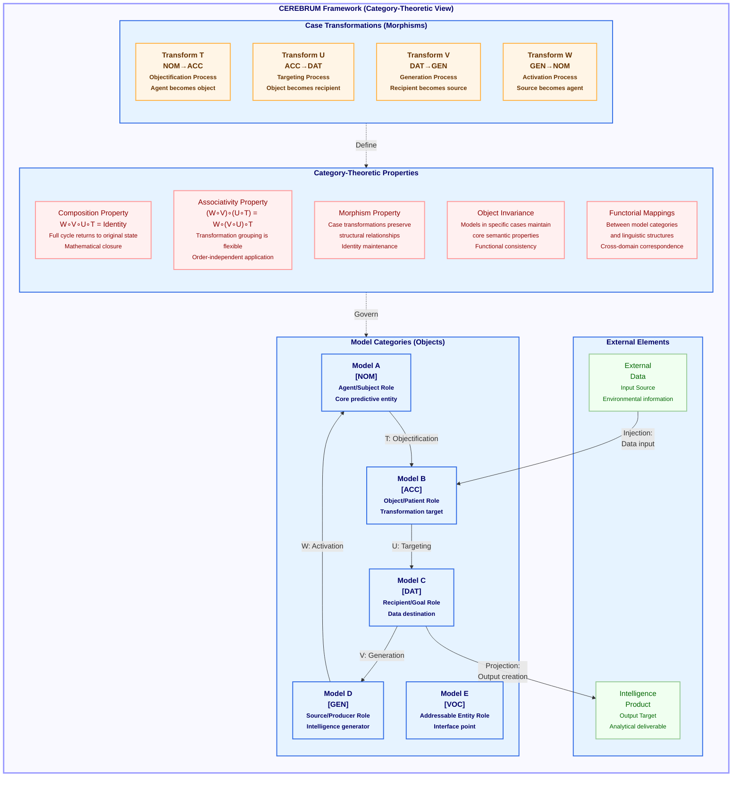

# Figure 7: CEREBRUM Category Theory Framework

Figure 7. CEREBRUM Category Theory Framework. This diagram formalizes the CEREBRUM framework using category theory, providing a rigorous mathematical foundation for model transformations. The framework represents cognitive models as objects in a category, with different case assignments (Nominative, Accusative, Dative, Genitive, Vocative) defining their functional roles. Case transformations are represented as morphisms (T, U, V, W) between these objects, establishing principled pathways for models to change their functional roles while preserving their core identity. The diagram highlights critical category-theoretic properties: the composition property ensures that a full cycle of transformations returns a model to its original state (W∘V∘U∘T = Identity); the associativity property enables flexible grouping of transformations; morphism properties ensure that transformations preserve structural relationships; and object invariance maintains core semantic properties across case changes. External elements interact with the framework through injection (input) and projection (output) operations. This category-theoretic approach provides CEREBRUM with formal verification of properties like identity preservation and compositional consistency, enabling sound reasoning about model transitions in complex workflows.

