# Figure 8: Category Theory Framework - Alternative Visualization

```mermaid
flowchart TB
    %% Title and description
    title["Category Theory Framework - Explicit Transformation Visualization"]
    
    subgraph Objects["🔵 Model Objects (Category Objects)"]
        direction TB
        A["👑 Active Model [NOM]<br><small>Generative Agent</small><br><small>Drives prediction & control</small>"]
        B["🎯 Processed Model [ACC]<br><small>Transformed Object</small><br><small>Receives updates & actions</small>"]
        C["📩 Receiving Model [DAT]<br><small>Data Recipient</small><br><small>Input processing endpoint</small>"]
        D["💫 Producing Model [GEN]<br><small>Output Generator</small><br><small>Creates intelligence products</small>"]
        E["📢 Addressable Model [VOC]<br><small>Named Interface</small><br><small>Command & control access point</small>"]
    end
    
    %% Define transforms as nodes with more explicit descriptions
    subgraph Transforms["🔄 Transformations (Morphisms)"]
        direction TB
        T["↓ Objectification NOM→ACC<br><small>Makes model receptive to modification</small><br><small>T: Changes agent to object</small>"]
        U["↓ Targeting ACC→DAT<br><small>Directs object to become recipient</small><br><small>U: Prepares for data reception</small>"]
        V["↓ Generation DAT→GEN<br><small>Transforms input receiver to output producer</small><br><small>V: Enables product creation</small>"]
        W["↓ Activation GEN→NOM<br><small>Restores agency to production source</small><br><small>W: Completes transformation cycle</small>"]
    end
    
    %% External elements with enhanced descriptions
    subgraph External["🌐 External Interfaces"]
        direction TB
        EX["📊 External Data<br><small>Category Input</small><br><small>Environmental information flow</small>"]
        F["📘 Intelligence Product<br><small>Category Output</small><br><small>Analytical deliverables</small>"]
    end
    
    subgraph Props["📐 Category Properties"]
        direction TB
        COMP["🔄 Composition Law<br>W∘V∘U∘T = I<br><small>Identity preservation</small><br><small>Full cycle returns model to original state</small>"]
        ASSOC["🔀 Associativity Law<br>(W∘V)∘(U∘T) = W∘(V∘U)∘T<br><small>Transformation grouping flexibility</small><br><small>Order-independent composition</small>"]
        IDENTITY["⚪ Identity Morphism<br>I: A→A<br><small>Self-transformation</small><br><small>Maintains model state</small>"]
        FUNCTOR["🔗 Functoriality<br><small>Structure preservation across categories</small><br><small>Maintains relationship semantics</small>"]
    end
    
    %% Connect the model objects through transforms with explicit path labeling
    A -->|"Step 1:<br>Becomes object"| T
    T -->|"Applies<br>objectification"| B
    B -->|"Step 2:<br>Becomes recipient"| U
    U -->|"Applies<br>targeting"| C
    C -->|"Step 3:<br>Becomes producer"| V
    V -->|"Applies<br>generation"| D
    D -->|"Step 4:<br>Becomes agent"| W
    W -->|"Applies<br>activation"| A
    
    %% Connect external elements with explanations
    EX -->|"Data input<br>injection"| B
    C -->|"Product output<br>projection"| F
    
    %% Add property connections with relationship types
    Props -.->|"Mathematically<br>guarantee"| Objects
    Props -.->|"Validate"| Transforms
    
    %% Enhanced styling with better accessibility
    classDef title fill:none,stroke:none,color:#000066,font-size:18px,font-weight:bold
    classDef object fill:#E6F3FF,stroke:#326CE5,stroke-width:2px,color:#000066,font-weight:bold
    classDef transform fill:#FFF5E6,stroke:#FFB347,stroke-width:2px,color:#663300,font-weight:bold
    classDef external fill:#F0FFF0,stroke:#99cc99,stroke-width:2px,color:#006600,font-weight:bold
    classDef property fill:#FFF0F0,stroke:#ff9999,stroke-width:2px,color:#8B0000,font-weight:bold
    classDef category fill:#f9f9ff,stroke:#9999ff,stroke-width:3px,color:#000066,font-weight:bold
    
    class title title
    class A,B,C,D,E object
    class T,U,V,W transform
    class EX,F external
    class COMP,ASSOC,IDENTITY,FUNCTOR property
    class Objects,Props,Transforms,External category
```

Figure 8. Category Theory Framework - Alternative Visualization. This diagram provides a complementary perspective to Figure 7, offering a more explicit representation of the transformations between case-bearing models in CEREBRUM. While Figure 7 presents the category-theoretic structure with a focus on properties and relationships, this visualization emphasizes the transformation process itself. Each case transformation (Objectification, Targeting, Generation, and Activation) is represented as a distinct node between model objects, clearly illustrating how models transition between different functional roles. The diagram highlights the cyclical nature of these transformations, with a model potentially moving from Nominative [NOM] through Accusative [ACC], Dative [DAT], and Genitive [GEN] cases before returning to its original state. Additionally, this representation explicitly shows the identity morphism (I: A→A) that maintains a model's state when no transformation is applied. External data enters the system through the Accusative case (as the object of processing), while intelligence products emerge from the Dative case (as recipients of information flows). Together with Figure 7, this diagram provides a complete formal description of the mathematical foundations underlying CEREBRUM's case transformation system.

