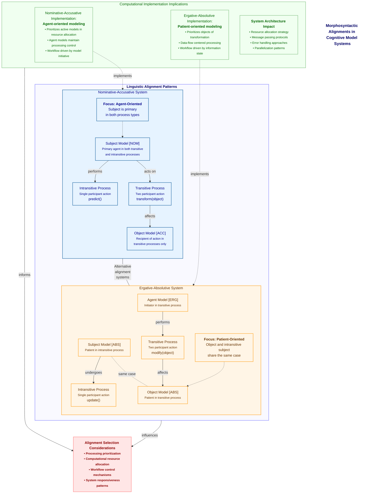

# Figure 9: Morphosyntactic Alignments in Model Relationships

Figure 9. Morphosyntactic Alignments in Model Relationships. This diagram illustrates two fundamental alignment patterns that can be applied to model relationships in CEREBRUM, derived from linguistic morphosyntactic structures. The Nominative-Accusative alignment (left) groups subject models in both intransitive and transitive processes, treating them as agents regardless of process type, while differentiating object models. This pattern prioritizes agency and control flow, making it ideal for agent-centric workflows where model initiative drives processing. In contrast, the Ergative-Absolutive alignment (right) groups subject models in intransitive processes with object models in transitive processes, treating them both as absolutive case [ABS], while differentiating agent models in transitive processes as ergative case [ERG]. This pattern emphasizes the recipients of actions rather than their initiators, making it suitable for data-flow-centric or patient-oriented modeling. The choice between these alignment patterns has significant cognitive implications, affecting how computational resources are allocated, how models are prioritized, and how processing sequences are ordered. By supporting multiple alignment patterns, CEREBRUM provides flexibility in designing model ecosystems that match different cognitive or computational requirements, allowing system architects to select the most appropriate pattern for specific tasks or domains.

