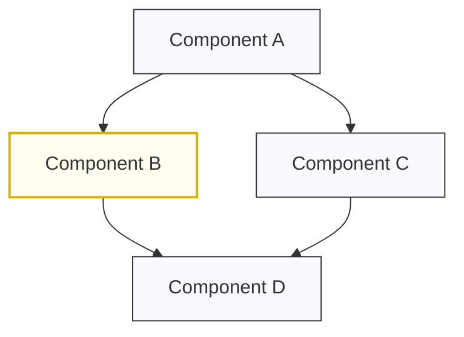

# Figure X: Figure Title



%% Notes:
%% 1. Replace "X" in the title with the figure number
%% 2. Update the title to describe the figure content
%% 3. Replace the mermaid code with your diagram
%% 4. The mermaid block must be wrapped in ```mermaid and ``` tags
%% 5. This file will be used to generate Figure_X.png during assembly 