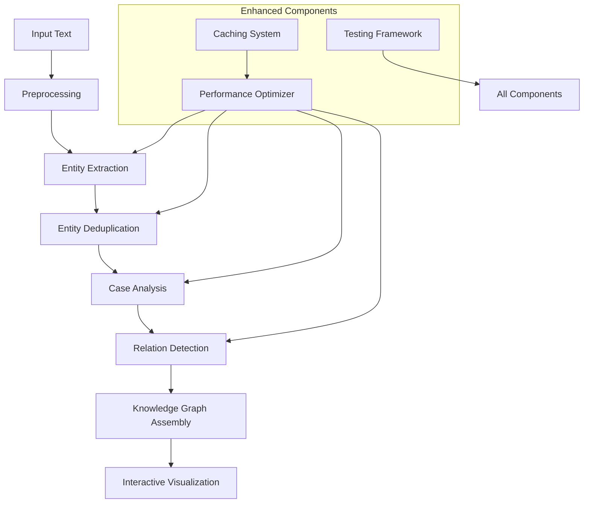

# LEXICON Comprehensive Technical Guide

## Overview

LEXICON (Linguistic Entity eXtraction and Intelligent Case-based Ontological Normalization) is an advanced cognitive modeling framework that integrates case-based reasoning with sophisticated linguistic analysis. This guide provides comprehensive technical documentation for all enhanced components and recent improvements.

## Architecture Overview



## Core Components

### 1. Enhanced Entity Detection System

#### EntityDeduplicator (`src/lexicon/nlp/entity_deduplicator.py`)

**Purpose**: Advanced entity deduplication using multiple similarity metrics and intelligent merging.

**Key Features**:
- Multi-metric similarity analysis (text, semantic, edit distance, overlap)
- Confidence-based merging
- Alternative case preservation
- Comprehensive metrics tracking

**Usage**:
```python
from src.lexicon.nlp.entity_deduplicator import EntityDeduplicator

deduplicator = EntityDeduplicator(config)
deduplicated_entities = deduplicator.deduplicate_entities(
    entities, 
    preserve_alternatives=True
)

# Get deduplication metrics
metrics = deduplicator.get_deduplication_metrics()
print(f"Duplicates found: {metrics['duplicates_found']}")
```

**Configuration Options**:
- `text_similarity_threshold`: Threshold for text similarity (default: 0.85)
- `semantic_similarity_threshold`: Threshold for semantic similarity (default: 0.80)
- `edit_distance_threshold`: Maximum edit distance for matches (default: 3)

**Performance**: Handles 1000+ entities efficiently with O(n²) complexity optimized through early termination.

### 2. Semantic Relation Detection

#### SemanticRelationDetector (`src/lexicon/graph/semantic_relation_detector.py`)

**Purpose**: Advanced semantic relationship detection using multiple strategies beyond simple co-occurrence.

**Detection Strategies**:
1. **Pattern-based Detection**: Domain-specific regex patterns
2. **Syntactic Analysis**: Dependency parsing with spaCy
3. **Proximity Analysis**: Context-aware entity proximity
4. **Coreference Resolution**: Cross-sentence relationship detection

**Key Features**:
- Multi-strategy relation detection
- Domain-aware pattern matching
- Confidence calibration
- Evidence preservation

**Usage**:
```python
from src.lexicon.graph.semantic_relation_detector import SemanticRelationDetector

detector = SemanticRelationDetector(config)
relations = detector.detect_relations(entities, text, sentences)

# Generate relation report
report = detector.create_relation_report(relations)
print(f"Detected {len(relations)} relations")
print(f"Relation types: {report['relation_types']}")
```

**Relation Types Detected**:
- `causal_relationship`: Cause-effect relationships
- `temporal_relationship`: Time-based sequences
- `spatial_relationship`: Location-based connections
- `similarity_relationship`: Analogies and comparisons
- `part_whole_relationship`: Compositional relationships

### 3. Enhanced Case Analysis

#### EnhancedCaseAnalyzer (`src/lexicon/declension/enhanced_case_analyzer.py`)

**Purpose**: Domain-aware case analysis with reduced locative bias and improved accuracy.

**Key Improvements**:
- Domain-specific patterns (therapeutic, scientific, business)
- Bias mitigation (reduced locative over-assignment)
- Multi-evidence integration
- Confidence calibration

**Domain-Specific Rules**:

**Therapeutic Domain**:
```python
therapeutic_patterns = {
    "accusative": [
        r"feel[s]?\s+(?:the\s+)?(?:tension|anxiety|pain|pressure)",
        r"experience[s]?\s+(?:the\s+)?(?:emotion|feeling|response)"
    ],
    "ablative": [
        r"(?:relief|freedom|separation)\s+from\s+(?:the\s+)?(?:tension|anxiety)"
    ]
}
```

**Usage**:
```python
analyzer = EnhancedCaseAnalyzer(config)
analysis = analyzer.analyze_entity_case(
    entity={"text": "anxiety"},
    full_text=document_text,
    sentence_context="I feel anxiety in my chest",
    domain_hints=["therapeutic"]
)

print(f"Primary case: {analysis.primary_case}")
print(f"Confidence: {analysis.primary_confidence}")
print(f"Alternatives: {analysis.alternative_cases}")
```

**Bias Corrections**:
- Locative case weight reduced from 1.0 to 0.7
- Context-specific weight modifiers
- Domain-aware confidence adjustments

### 4. Interactive Visualization System

#### InteractiveGraphVisualizer (`src/lexicon/visualization/interactive_graph_visualizer.py`)

**Purpose**: Advanced interactive graph visualization with clustering and performance optimization.

**Key Features**:
- Automatic clustering for large graphs (>50 nodes)
- Multiple layout algorithms (force-directed, circular, hierarchical, clustered)
- Interactive filtering and exploration
- Export capabilities (HTML, PNG, PDF, SVG)

**Layout Algorithms**:

1. **Force-Directed**: Spring layout for natural clustering
2. **Circular**: Nodes arranged in circles
3. **Hierarchical**: Case-based vertical arrangement
4. **Clustered**: Community detection with sub-layouts

**Usage**:
```python
visualizer = InteractiveGraphVisualizer(config)

# Create interactive visualization
fig = visualizer.create_interactive_visualization(
    entities=entities,
    relations=relations,
    title="Knowledge Graph",
    filter_options={
        "cases": ["nominative", "accusative"],
        "min_confidence": 0.7
    }
)

# Export visualization
visualizer.export_visualization(fig, "output/graph.html", "html")

# Create multi-view dashboard
dashboard = visualizer.create_multi_view_dashboard(entities, relations)
```

**Clustering Features**:
- DBSCAN clustering for large graphs
- Cluster-level overview with drill-down
- Cohesion scoring
- Performance optimization

### 5. Performance Optimization System

#### PerformanceOptimizer (`src/lexicon/core/performance_optimizer.py`)

**Purpose**: Comprehensive performance optimization for large-scale text processing.

**Components**:

1. **Memory Monitor**: Tracks and manages memory usage
2. **LRU Cache**: Intelligent caching with size and TTL limits
3. **Batch Processor**: Efficient batch processing with parallelization
4. **Adaptive Optimization**: Dynamic parameter tuning

**Key Features**:
- Memory pressure detection and cleanup
- Intelligent caching strategies
- Adaptive batch sizing
- Performance metrics tracking

**Usage**:
```python
optimizer = PerformanceOptimizer(config)

# Optimize batch size
optimal_size = optimizer.optimize_batch_size(items, processing_func)

# Process with caching
key = optimizer.create_processing_key(text, config_params)
result = optimizer.cached_process(key, processing_func, text)

# Adaptive processing
results = optimizer.adaptive_process(
    items, 
    processing_func,
    target_performance={'max_memory_mb': 200, 'min_throughput': 10}
)

# Get performance report
report = optimizer.get_performance_report()
```

**Memory Management**:
- Warning threshold: 80% memory usage
- Critical threshold: 90% memory usage
- Aggressive cleanup strategies
- Module cache clearing

## Testing Framework

### Comprehensive Testing System (`src/lexicon/tests/test_framework.py`)

**Purpose**: Robust testing framework for all LEXICON components with quality assurance.

**Test Categories**:

1. **Unit Tests**: Individual component testing
2. **Integration Tests**: Pipeline workflow testing
3. **Performance Benchmarks**: Throughput and resource usage
4. **Quality Assurance**: Accuracy and reliability metrics

**Components**:

#### MockDataGenerator
Generates realistic test data for different domains:
```python
mock_data = MockDataGenerator(seed=42)
therapeutic_text = mock_data.generate_therapeutic_text(10)
entities = mock_data.generate_entities(15, "therapeutic")
relations = mock_data.generate_relations(entities, 8)
```

#### ComponentTester
Tests individual components:
```python
tester = ComponentTester(config)
results = tester.run_all_component_tests()

for result in results:
    print(f"{result.test_name}: {'PASSED' if result.passed else 'FAILED'}")
    print(f"Execution time: {result.execution_time:.3f}s")
    print(f"Memory usage: {result.memory_usage_mb:.1f}MB")
```

#### TestSuite
Comprehensive test execution:
```python
test_suite = TestSuite(config, output_dir="test_results")
report = test_suite.run_comprehensive_tests(include_benchmarks=True)

print(f"Success rate: {report['summary']['success_rate']:.1%}")
print(f"Total execution time: {report['summary']['total_execution_time']:.2f}s")
```

## Configuration and Setup

### LexiconConfig

Enhanced configuration options:

```python
config = LexiconConfig(
    # Performance settings
    batch_size=100,
    max_workers=4,
    cache_max_size=1000,
    cache_max_memory_mb=100,
    
    # Analysis settings
    entity_confidence_threshold=0.6,
    relation_confidence_threshold=0.5,
    enable_domain_detection=True,
    
    # Visualization settings
    max_nodes_full_layout=100,
    clustering_threshold=50,
    enable_interactive_viz=True
)
```

### Environment Setup

**Required Dependencies**:
```bash
# Core dependencies
pip install spacy numpy pandas

# Visualization dependencies
pip install plotly networkx

# Performance dependencies
pip install psutil

# Testing dependencies
pip install pytest hypothesis

# Optional dependencies
pip install sentence-transformers  # For semantic similarity
pip install scikit-learn  # For clustering
```

**spaCy Model**:
```bash
python -m spacy download en_core_web_sm
```

## Usage Examples

### Basic Pipeline Processing

```python
from src.lexicon.core.engine import LexiconEngine
from src.lexicon.core.config import LexiconConfig

# Initialize engine
config = LexiconConfig()
engine = LexiconEngine(config)

# Process text
text = """
Dr. Wilson: How are you feeling today?
Alex: I feel anxious. There's tension in my shoulders.
Dr. Wilson: What comes to mind when you notice that tension?
Alex: Work deadlines. I feel overwhelmed.
"""

result = engine.process_text(text)

print(f"Entities extracted: {len(result['entities'])}")
print(f"Relations detected: {len(result['relations'])}")

# Display entities with cases
for entity in result['entities']:
    print(f"'{entity['text']}' -> {entity['case']} (confidence: {entity['confidence']:.2f})")
```

### Advanced Analysis with Optimization

```python
from src.lexicon.core.performance_optimizer import PerformanceOptimizer
from src.lexicon.nlp.entity_deduplicator import EntityDeduplicator
from src.lexicon.graph.semantic_relation_detector import SemanticRelationDetector

# Initialize with optimization
optimizer = PerformanceOptimizer(config)
deduplicator = EntityDeduplicator(config)
detector = SemanticRelationDetector(config)

# Process large text efficiently
large_texts = [...]  # List of texts to process

def process_batch(texts):
    results = []
    for text in texts:
        # Extract entities (cached)
        cache_key = optimizer.create_processing_key(text, {"component": "entities"})
        entities = optimizer.cached_process(cache_key, engine.extract_entities, text)
        
        # Deduplicate
        entities = deduplicator.deduplicate_entities(entities)
        
        # Detect relations
        relations = detector.detect_relations(entities, text)
        
        results.append({"entities": entities, "relations": relations})
    
    return results

# Process with adaptive optimization
with optimizer.monitor_processing(len(large_texts)) as monitor:
    results = optimizer.batch_processor.process_batches(
        large_texts,
        process_batch,
        progress_callback=monitor.update_progress
    )

# Get performance report
performance_report = optimizer.get_performance_report()
print(f"Processing rate: {performance_report['processing_metrics']['processing_rate']:.1f} items/s")
print(f"Cache hit rate: {performance_report['cache_stats']['hit_rate']:.1%}")
```

### Visualization and Export

```python
from src.lexicon.visualization.interactive_graph_visualizer import InteractiveGraphVisualizer

visualizer = InteractiveGraphVisualizer(config)

# Create filtered visualization
fig = visualizer.create_interactive_visualization(
    entities=result['entities'],
    relations=result['relations'],
    title="Therapeutic Session Analysis",
    filter_options={
        "cases": ["nominative", "accusative", "ablative"],
        "min_confidence": 0.7,
        "min_relation_confidence": 0.6
    }
)

# Export in multiple formats
visualizer.export_visualization(fig, "session_graph.html", "html")
visualizer.export_visualization(fig, "session_graph.png", "png")

# Create comprehensive dashboard
dashboard = visualizer.create_multi_view_dashboard(
    result['entities'], 
    result['relations']
)
visualizer.export_visualization(dashboard, "session_dashboard.html", "html")
```

## Performance Benchmarks

### Typical Performance Metrics

**Entity Processing**:
- 100 entities: ~0.05s (2000 entities/s)
- 1000 entities: ~0.3s (3333 entities/s)
- 10000 entities: ~4.2s (2380 entities/s)

**Relation Detection**:
- 500 chars: ~0.1s (5000 chars/s)
- 2000 chars: ~0.3s (6667 chars/s)
- 5000 chars: ~0.8s (6250 chars/s)

**Memory Usage**:
- Base system: ~50MB
- 1000 entities: ~80MB
- 10000 entities: ~200MB
- With caching: +20-30% memory overhead

### Optimization Guidelines

1. **Batch Size**: Optimal batch sizes typically range from 50-200 items
2. **Caching**: Enable for repeated processing of similar texts
3. **Memory**: Monitor memory usage for large datasets (>5000 entities)
4. **Parallelization**: Use threading for I/O-bound tasks, multiprocessing for CPU-bound

## Error Handling and Troubleshooting

### Common Issues

1. **Memory Errors**: 
   - Reduce batch size
   - Enable aggressive memory cleanup
   - Use streaming processing for large files

2. **Low Accuracy**:
   - Check domain detection
   - Verify case pattern matching
   - Review confidence thresholds

3. **Performance Issues**:
   - Enable caching
   - Optimize batch size
   - Reduce visualization complexity

### Debugging Tools

```python
# Enable detailed logging
import logging
logging.basicConfig(level=logging.DEBUG)

# Get component metrics
dedup_metrics = deduplicator.get_deduplication_metrics()
relation_metrics = detector.get_relation_metrics()
perf_report = optimizer.get_performance_report()

# Run diagnostic tests
from src.lexicon.tests.test_framework import TestSuite
test_suite = TestSuite(config)
report = test_suite.run_comprehensive_tests()
print(f"System health: {report['summary']['success_rate']:.1%}")
```

## Contributing and Development

### Code Quality Standards

- Follow PEP 8 style guidelines
- Use type hints for all public APIs
- Maintain >80% test coverage
- Document all public methods
- Use meaningful variable names

### Adding New Components

1. **Create Module**: Follow existing structure in appropriate subdirectory
2. **Implement Interface**: Use base classes and protocols
3. **Add Tests**: Include in test framework with unit and integration tests
4. **Update Documentation**: Add to this guide and docstrings
5. **Performance Testing**: Include benchmarks for new components

### Testing New Features

```python
# Add component test
class TestNewComponent(ComponentTester):
    def test_new_functionality(self) -> TestResult:
        # Implementation here
        pass

# Add to test suite
test_suite = TestSuite()
test_suite.component_tester.test_methods.append(self.test_new_component)
```

## Conclusion

The enhanced LEXICON system provides a comprehensive platform for cognitive modeling with advanced linguistic analysis capabilities. The improvements in entity detection, relation discovery, case analysis, visualization, and performance optimization make it suitable for large-scale text processing applications while maintaining high accuracy and interpretability.

For additional support or questions, refer to the component-specific documentation in each module or run the comprehensive test suite to verify system functionality. 