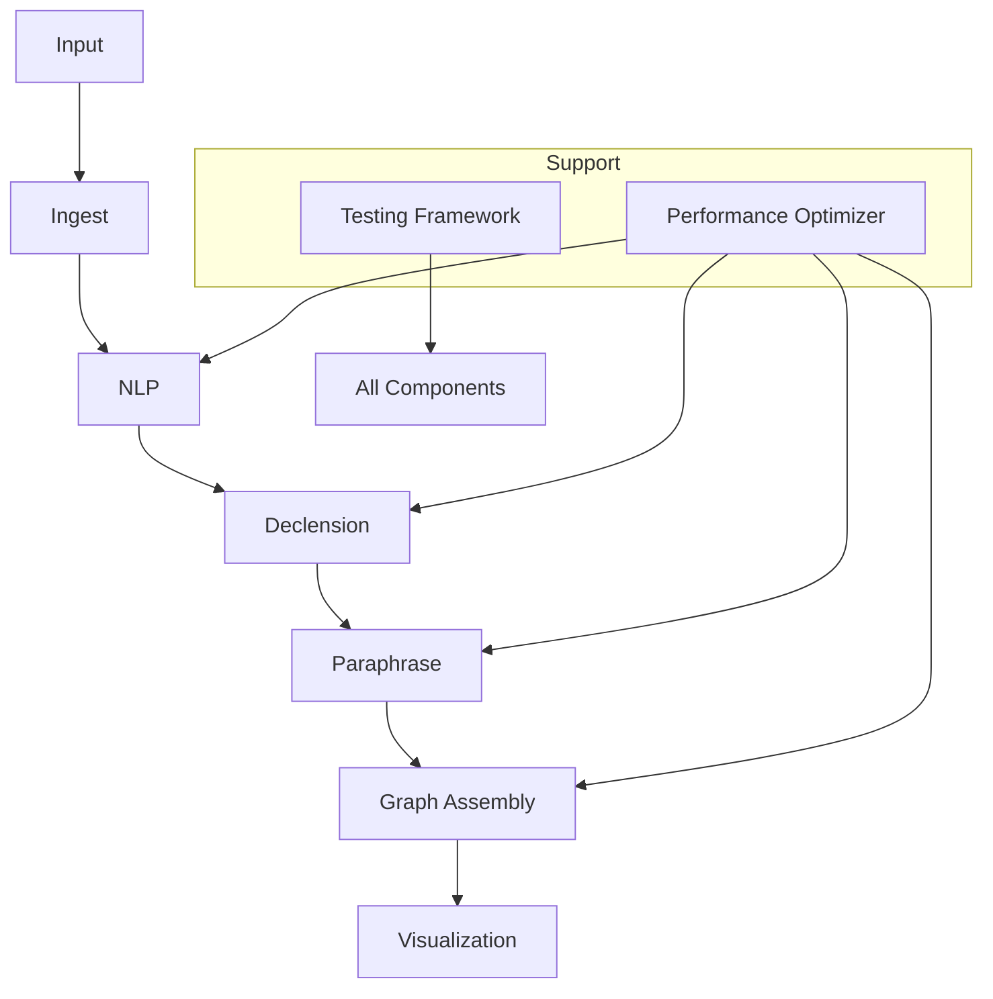

# LEXICON Comprehensive Technical Guide

## Overview

LEXICON integrates case-based reasoning with linguistic analysis for cognitive modeling.

## Architecture



## Core Components

### 1. Entity Deduplication

**File**: `nlp/entity_deduplicator.py`

**Features**:
- Multi-metric similarity
- Confidence merging
- Alternatives preservation

**Usage**:
```python
deduplicator = EntityDeduplicator(config)
deduplicated = deduplicator.deduplicate_entities(entities)
```

### 2. Relation Detection

**File**: `graph/semantic_relation_detector.py`

**Strategies**:
- Pattern-based
- Syntactic analysis
- Proximity
- Coreference

**Usage**:
```python
detector = SemanticRelationDetector(config)
relations = detector.detect_relations(entities, text)
```

### 3. Case Analysis

**File**: `declension/enhanced_case_analyzer.py`

**Features**:
- Domain patterns
- Bias mitigation
- Evidence integration

**Usage**:
```python
analyzer = EnhancedCaseAnalyzer(config)
analysis = analyzer.analyze_entity_case(entity, text, sentence)
```

### 4. Visualization

**File**: `visualization/interactive_graph_visualizer.py`

**Features**:
- Clustering
- Layouts
- Interactive filtering
- Exports

**Usage**:
```python
visualizer = InteractiveGraphVisualizer(config)
fig = visualizer.create_interactive_visualization(entities, relations)
visualizer.export_visualization(fig, 'graph.html', 'html')
```

### 5. Performance Optimization

**File**: `core/performance_optimizer.py`

**Features**:
- Memory monitoring
- Caching
- Batch processing
- Adaptive optimization

**Usage**:
```python
optimizer = PerformanceOptimizer(config)
results = optimizer.adaptive_process(items, func)
```

## Testing Framework

**File**: `tests/test_framework.py`

**Components**:
- MockDataGenerator
- ComponentTester
- IntegrationTester
- PerformanceBenchmarker
- TestSuite

**Usage**:
```python
test_suite = TestSuite(config)
report = test_suite.run_comprehensive_tests()
print(f'Success rate: {report['summary']['success_rate']:.1%}')
```

## Configuration

```python
config = LexiconConfig(
    default_model='anthropic/claude-3.5-sonnet',
    batch_size=100,
    max_workers=4,
    cache_max_size=1000
)
```

## Setup

**Dependencies**:
```bash
pip install spacy numpy pandas plotly networkx psutil pytest hypothesis
python -m spacy download en_core_web_sm
```

## Usage Examples

### Basic Processing

```python
engine = LexiconEngine(config)
result = engine.process_text(text)
print(f'Entities: {len(result['entities'])}')
```

### Advanced

```python
optimizer = PerformanceOptimizer(config)
results = optimizer.adaptive_process(texts, process_batch)
```

### Visualization

```python
visualizer = InteractiveGraphVisualizer(config)
fig = visualizer.create_interactive_visualization(entities, relations)
```

## Performance

**Benchmarks**:
- Entities: 2380/s (10k)
- Relations: 6250 chars/s (5k)
- Memory: ~200MB (10k entities)

## Troubleshooting

- Set OPENROUTER_API_KEY
- Install visualization packages
- Check write permissions

## Contributing

- PEP 8 style
- Type hints
- >80% coverage
- Documentation

## Conclusion

LEXICON enables advanced text analysis. Run tests for verification. 