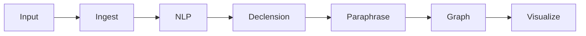

# LEXICON Engine Technical Specification

*(Linguistic Entity eXtraction and Iterative Case-Oriented Navigation)*

## Module Structure

Current structure under src/lexicon/:

```
src/lexicon/
├── core/                          # Core engine components
│   ├── __init__.py
│   ├── config.py                  # System configuration
│   ├── engine.py                  # Main pipeline orchestrator
│   ├── environment.py             # Environment setup
│   ├── exceptions.py              # Custom exceptions
│   ├── logging.py                 # Logging utilities
│   ├── performance_optimizer.py   # Performance optimization
│   └── session.py                 # Session management
├── declension/                    # Case declension system
│   ├── __init__.py
│   ├── enhanced_case_analyzer.py  # Advanced case analysis
│   ├── openrouter_client.py       # LLM integration
│   ├── rules.py                   # Linguistic rules
│   ├── structured_case_determiner.py  # Structured case determination
│   └── tagger.py                  # Case tagging engine
├── docs/                          # Documentation
│   ├── comprehensive_technical_guide.md
│   ├── lexicon_tech_overview.md
│   └── lexicon_usage_guide.md
├── examples/                      # Usage examples
│   ├── __init__.py
│   ├── basic_usage.py
│   ├── process_file.py
│   └── README.md
├── graph/                         # Graph assembly
│   ├── __init__.py
│   ├── assembler.py               # Graph building
│   ├── cid_generator.py           # ID generation
│   ├── entity_linker.py           # Entity linking
│   └── semantic_relation_detector.py  # Relation detection
├── ingest/                        # Input processing
│   ├── __init__.py
│   ├── asr_wrapper.py             # Audio transcription
│   ├── batch_processor.py         # Batch processing
│   ├── file_watcher.py            # File monitoring
│   └── format_parsers/            # Format-specific parsers
│       ├── __init__.py
│       ├── meeting_transcript.py
│       ├── podcast_vtt.py
│       ├── twitter_thread.py
│       └── README.md
├── input/                         # Sample inputs
│   └── therapy_session.md
├── nlp/                           # NLP processing
│   ├── __init__.py
│   ├── coreference_resolver.py    # Coreference resolution
│   ├── entity_deduplicator.py     # Entity deduplication
│   ├── ner_extractor.py           # Named entity recognition
│   ├── pos_tagger.py              # POS tagging
│   ├── preprocessor.py            # NLP pipeline
│   └── sentence_splitter.py       # Sentence splitting
├── paraphrase/                    # Paraphrase generation
│   ├── __init__.py
│   ├── cache.py                   # Caching
│   ├── generator.py               # Paraphrase engine
│   └── prompt_templates.py        # Prompt templates
├── README.md                      # Module documentation
├── run.py                         # Entry point script
├── tests/                         # Tests
│   ├── __init__.py
│   ├── README.md
│   ├── test_components.py
│   ├── test_end_to_end.py
│   └── test_framework.py
└── visualization/                 # Visualization tools
    ├── __init__.py
    ├── analyzer.py                # Result analysis
    ├── animated_graph.py          # Animated graphs
    ├── entity_neighborhood.py     # Entity visualizations
    ├── graph_visualizer.py        # Graph visualization
    ├── interactive_graph_visualizer.py  # Interactive viz
    └── README.md
```

### Dependencies

**CEREBRUM Integration:**
- `src/models/case_definitions.py` - Case definitions
- `src/core/model.py` - Base model
- `src/transformations/case_transformations.py` - Transformations
- `src/visualization/case_visualization.py` - Visualization

**Third-Party:**
- OpenRouter API - LLM operations
- Whisper - Audio transcription
- SpaCy - NLP processing
- NetworkX, Matplotlib - Visualization
- NumPy, ImageIO - Data handling

**Development:**
- Python - Core language
- Logging - Observability

## Overview

LEXICON transforms unstructured text into case-declined knowledge graphs using CEREBRUM's linguistic cases. Pipeline:
1. **Ingest** text/audio
2. **NLP** preprocessing
3. **Decline** cases
4. **Generate** paraphrases
5. **Assemble** graphs
6. **Visualize** results

## Architecture

### Pipeline Layers

| Layer | Components | Tech | Case Mapping | Status |
|-------|------------|------|--------------|--------|
| **Ingest** | ASR, parsers | Whisper, Python | VOC | ✅ |
| **NLP** | Splitting, POS, NER | SpaCy | DAT | ✅ |
| **Declension** | Tagger, rules | OpenRouter | ACC→NOM | ✅ |
| **Paraphrase** | Generator | OpenRouter | GEN | ✅ |
| **Graph** | Assembler | Python | INS | ✅ |
| **Visualization** | Graphs, animations | Matplotlib | LOC | ✅ |

### Data Flow



## OpenRouter Integration

Uses OpenRouter for LLM tasks.

### Models

| Use Case | Primary | Fallbacks |
|----------|---------|-----------|
| Declension | claude-3.5-sonnet | gpt-4o-mini, llama-3.1-70b |
| Paraphrase | gpt-4o-mini | claude-3-haiku, mistral-nemo |

## Data Model

| Concept | Fields | Case | Type |
|---------|--------|------|------|
| **Entity** | id, text, type | NOM | Node |
| **Claim** | id, text, polarity | ACC | Node |
| **Relation** | id, source, target, type | GEN | Edge |

## Algorithms

### Declension Tagger

Hybrid rule + LLM approach for case assignment.

### Graph Assembly

Builds nodes/edges from cased segments.

## Usage Flows

### Processing

1. Input text/audio
2. Preprocess
3. Tag cases
4. Generate paraphrases
5. Build graph
6. Visualize

## API

Command-line via run.py. No web API yet.

## Performance

Targets: <30s end-to-end for typical inputs.

## Deployment

Local via run.py.

## CEREBRUM Integration

Uses case definitions and transformations.

## Value

Transforms text to graphs for analysis.

## Experiments

Planned studies on accuracy.

## Questions

Cross-lingual support, scaling.

## Conclusion

LEXICON provides practical text-to-graph conversion.

---

**Contact**: lexicon-dev@cerebrum.ai  
**Docs**: docs/  
**Repo**: github.com/cerebrum/lexicon