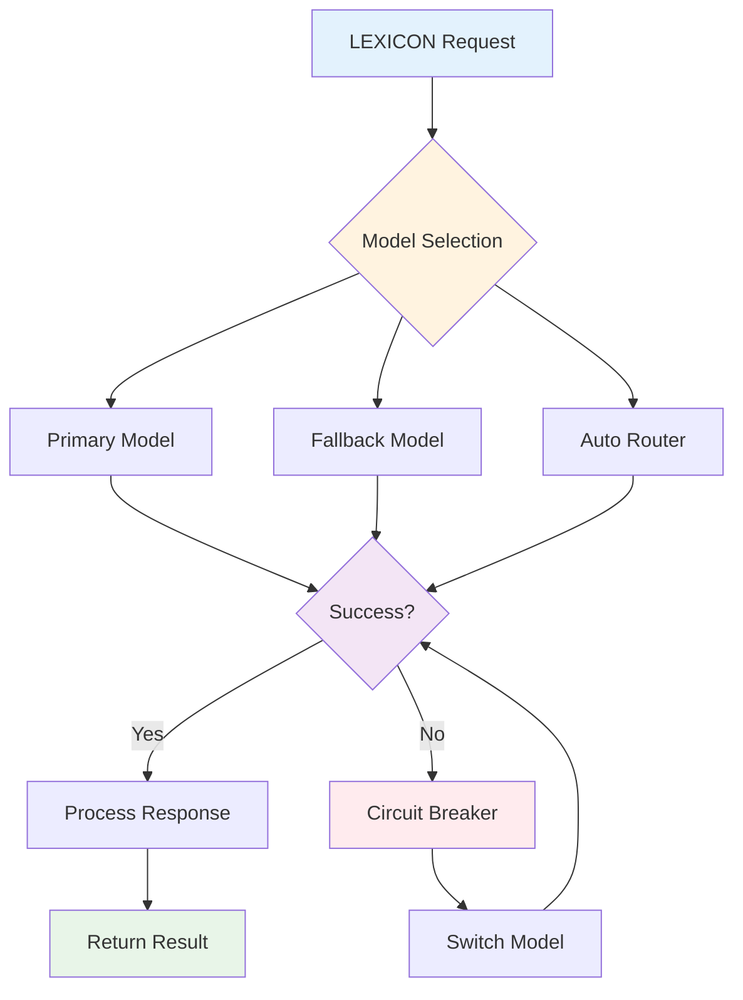
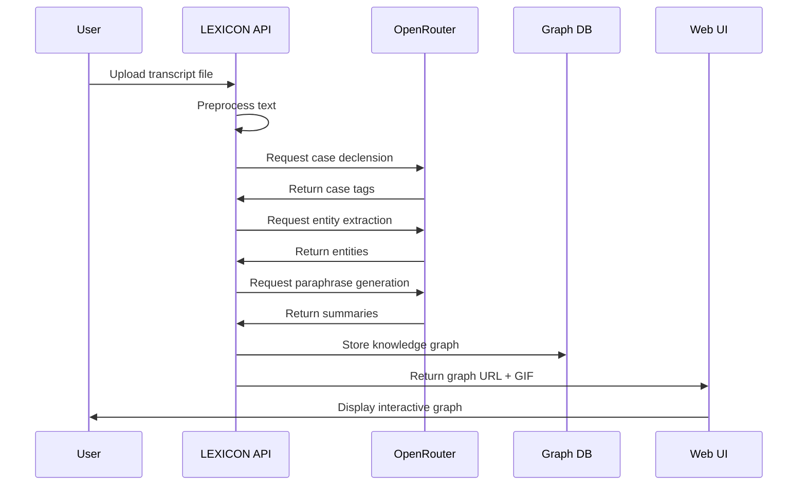
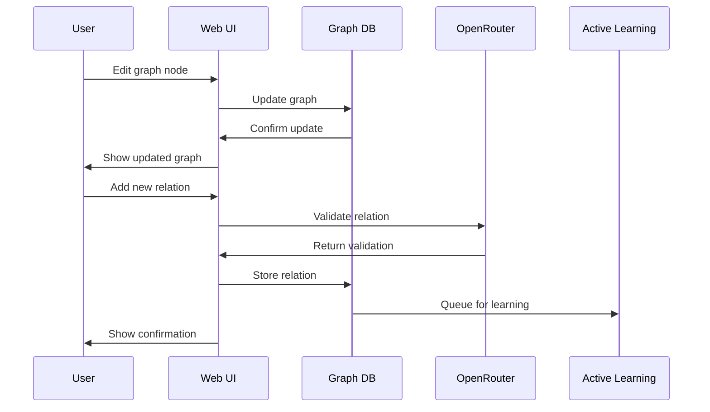
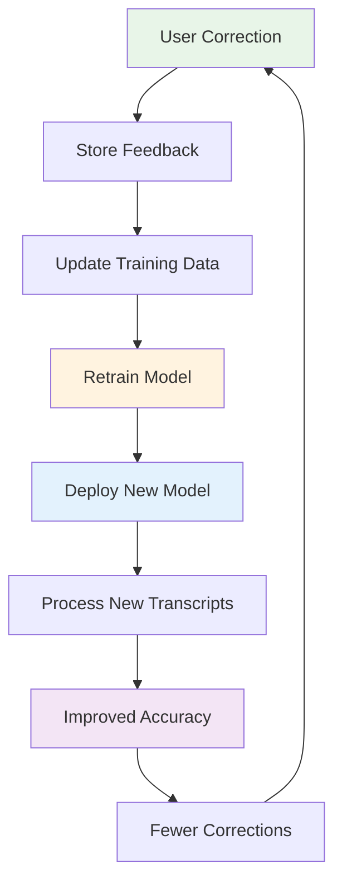
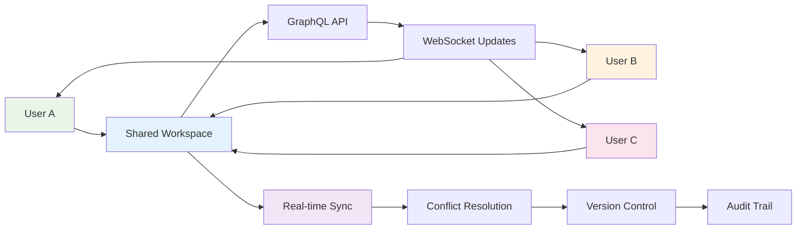

# LEXICON Engine Technical Specification

*(Linguistic Entity eXtraction and Iterative Case-Oriented Navigation)*

## Module Structure & Dependencies

LEXICON requires the following comprehensive module structure to run the entire system:

```
src/lexicon/
├── core/                          # Core engine components
│   ├── __init__.py
│   ├── engine.py                  # Main LEXICON pipeline orchestrator
│   ├── config.py                  # OpenRouter and system configuration
│   ├── exceptions.py              # Custom exception classes
│   └── logging.py                 # Structured logging setup
├── ingest/                        # Input processing modules
│   ├── __init__.py
│   ├── file_watcher.py           # File system monitoring
│   ├── webhook_handler.py        # HTTP webhook processing
│   ├── asr_wrapper.py            # Whisper v3 audio transcription
│   └── format_parsers/           # Format-specific parsers
│       ├── __init__.py
│       ├── podcast_vtt.py        # VTT subtitle parsing
│       ├── meeting_transcript.py # Meeting format parsing
│       └── twitter_thread.py     # Twitter thread parsing
├── nlp/                          # NLP preprocessing pipeline
│   ├── __init__.py
│   ├── preprocessor.py           # Main NLP orchestration
│   ├── sentence_splitter.py      # Sentence boundary detection
│   ├── speaker_diarization.py    # Speaker identification
│   ├── pos_tagger.py             # Part-of-speech tagging
│   ├── ner_extractor.py          # Named entity recognition
│   ├── coreference_resolver.py   # Coreference resolution
│   └── rust_extensions/          # High-performance Rust components
│       ├── __init__.py
│       ├── sentence_splitter.rs  # SIMD-optimized splitting
│       └── tokenizer.rs          # Fast tokenization
├── declension/                   # Case declension system
│   ├── __init__.py
│   ├── tagger.py                 # Main case tagging engine
│   ├── rules.py                  # Linguistic rule engine
│   ├── openrouter_client.py      # OpenRouter integration
│   ├── models/                   # Model-specific handlers
│   │   ├── __init__.py
│   │   ├── claude_handler.py     # Claude model interface
│   │   ├── gpt_handler.py        # GPT model interface
│   │   └── llama_handler.py      # LLaMA model interface
│   └── training/                 # Active learning components
│       ├── __init__.py
│       ├── data_collector.py     # Training data collection
│       ├── model_trainer.py      # Model retraining logic
│       └── feedback_processor.py # User feedback processing
├── paraphrase/                   # Micro-paraphrase generation
│   ├── __init__.py
│   ├── generator.py              # Main paraphrase engine
│   ├── prompt_templates.py       # Few-shot prompt templates
│   ├── quality_checker.py        # Paraphrase quality validation
│   └── cache.py                  # Local file-based caching
├── graph/                        # Knowledge graph assembly
│   ├── __init__.py
│   ├── assembler.py              # Main graph assembly engine
│   ├── entity_linker.py          # Entity linking and disambiguation
│   ├── relation_extractor.py     # Relation extraction
│   ├── cid_generator.py          # Content ID generation
│   ├── serializers/              # Graph serialization formats
│   │   ├── __init__.py
│   │   ├── jsonld.py             # JSON-LD serialization
│   │   ├── json.py               # Simple JSON serialization
│   │   └── rdf.py                # RDF/OWL export
│   └── queries/                  # Graph query engines
│       ├── __init__.py
│       ├── simple_query.py       # Basic graph traversal
│       └── search.py             # Text-based search
├── api/                          # API layer components
│   ├── __init__.py
│   ├── fastapi_app.py            # FastAPI application setup
│   ├── simple_graphql.py         # Basic GraphQL implementation
│   ├── websocket_handler.py      # WebSocket diff-push system
│   ├── middleware/               # API middleware
│   │   ├── __init__.py
│   │   ├── auth.py               # Simple authentication
│   │   ├── rate_limiting.py      # Basic rate limiting
│   │   └── cors.py               # CORS handling
│   └── routes/                   # REST API routes
│       ├── __init__.py
│       ├── ingest.py             # Ingestion endpoints
│       ├── graph.py              # Graph manipulation endpoints
│       └── health.py             # Health check endpoints
├── ui/                           # Web UI components
│   ├── __init__.py
│   ├── frontend/                 # Simple HTML/JS frontend
│   │   ├── index.html            # Main application page
│   │   ├── css/                  # Stylesheets
│   │   ├── js/                   # JavaScript components
│   │   └── assets/               # Static assets
│   ├── graph_editor.py           # Bidirectional prose↔graph editor
│   ├── gif_builder.py            # Magic-moment GIF generation
│   └── visualization/            # Graph visualization components
│       ├── __init__.py
│       ├── d3_force.py           # D3.js force-directed layout
│       ├── simple_viewer.py      # Basic graph viewer
│       └── animations.py         # Graph animation system
├── storage/                      # Data storage layer
│   ├── __init__.py
│   ├── local_graph.py            # Local file-based graph storage
│   ├── cache.py                  # Local file-based caching
│   ├── file_storage.py           # File storage management
│   └── migrations/               # Data migrations
│       ├── __init__.py
│       └── schema_updates.py     # Schema migration scripts
├── monitoring/                   # Observability components
│   ├── __init__.py
│   ├── simple_tracing.py         # Basic request tracing
│   ├── metrics.py                # Simple performance metrics
│   ├── logging.py                # Structured logging
│   └── health_checks.py          # Health check system
├── deployment/                   # Simple deployment configuration
│   ├── __init__.py
│   ├── requirements.txt          # Python dependencies
│   ├── run.py                    # Simple startup script
│   └── config/                   # Configuration files
│       ├── __init__.py
│       ├── development.py        # Development settings
│       └── production.py         # Production settings
├── tests/                        # Comprehensive test suite
│   ├── __init__.py
│   ├── unit/                     # Unit tests
│   │   ├── test_engine.py        # Engine unit tests
│   │   ├── test_declension.py    # Declension unit tests
│   │   └── test_graph.py         # Graph unit tests
│   ├── integration/              # Integration tests
│   │   ├── test_pipeline.py      # End-to-end pipeline tests
│   │   ├── test_api.py           # API integration tests
│   │   └── test_openrouter.py    # OpenRouter integration tests
│   ├── performance/              # Performance tests
│   │   ├── test_latency.py       # Latency benchmarks
│   │   └── test_throughput.py    # Throughput benchmarks
│   └── fixtures/                 # Test data and fixtures
│       ├── sample_transcripts/   # Sample transcript files
│       ├── expected_graphs/      # Expected graph outputs
│       └── mock_responses/       # Mock API responses
├── docs/                         # Documentation
│   ├── __init__.py
│   ├── api/                      # API documentation
│   ├── deployment/               # Deployment guides
│   ├── development/              # Development guides
│   └── user_guides/              # User documentation
└── scripts/                      # Utility scripts
    ├── __init__.py
    ├── setup.py                  # Development environment setup
    ├── benchmark.py              # Performance benchmarking
    ├── data_generator.py         # Synthetic data generation
    └── migration.py              # Data migration utilities
```

### External Dependencies

**CEREBRUM Core Integration:**
- `src/models/case_definitions.py` - Linguistic case definitions
- `src/core/model.py` - Base model framework
- `src/transformations/case_transformations.py` - Case transformation logic
- `src/visualization/case_visualization.py` - Case-aware visualization

**Third-Party Services:**
- **OpenRouter API** - All LLM operations
- **SQLite** - Local graph database storage
- **JSON files** - Plaintext graph storage and caching
- **Whisper v3** - Audio transcription
- **SpaCy** - NLP preprocessing
- **FastAPI** - Web API framework
- **Simple GraphQL** - Basic GraphQL implementation
- **HTML/JavaScript** - Simple frontend
- **D3.js** - Graph visualization

**Development Tools:**
- **Rust** - High-performance NLP extensions
- **Python** - Main application language
- **SQLite** - Local database
- **File system** - Plaintext storage
- **Basic logging** - Simple observability

## Overview

LEXICON is a high-performance analysis engine that transforms unstructured language artifacts—raw transcripts, podcasts, meeting notes, Twitter threads—into tightly-typed, case-declined knowledge graphs. It operationalizes CEREBRUM's linguistic-case semantics through a specialized pipeline that:

1. **Ingests** text or audio (with ASR) via multiple interfaces
2. **Processes** through fast, low-friction NLP preprocessing (<30s end-to-end)
3. **Declines** entities, claims, and relations with CEREBRUM's 8-case system
4. **Emits** editable, interoperable graphs (JSON + simple GraphQL) with micro-summaries

## Target V0.1 Market Wedge

**Primary Users**: Transcript-heavy researchers who:
- Work with long-form dialogue (podcasts, interviews, meetings)
- Lack formal schema engineering skills
- Need immediate "magic-moment" graph feedback
- Value speed and UX over formal rigor

**Secondary Users**: Podcast tooling vendors, ontology engineers, MAS builders

## Architecture Overview

LEXICON implements a simplified layered architecture with the following components:

### Core Pipeline Layers

| Layer | Components | Technology Stack | CEREBRUM Case Mapping | Performance Targets | Implementation Status |
|-------|------------|------------------|----------------------|-------------------|---------------------|
| **Ingest** | File watcher, Webhook, ASR wrapper | Python FastAPI + Whisper v3 | VOC (addressable endpoint) | <10s/MB audio | 🟡 Planned |
| **NLP Pre-Parse** | Sentence splitting, Speaker diarization, POS/NER, Coreference | Rust extension + SIMD + SpaCy | DAT (data receipt) | 300 w/s | 🟡 Planned |
| **Case Declension** | Rule-augmented sequence labeler | OpenRouter + local processing | ACC→NOM loop | 85% F1 | 🟡 Planned |
| **Micro-Paraphrase** | Few-shot LLM generation | OpenRouter + local caching | GEN (output generation) | <0.5s/segment | 🟡 Planned |
| **Graph Assembly** | Property graph builder | SQLite + JSON files | INS (instrumental) | <50ms/node | 🟡 Planned |
| **UI API** | Simple GraphQL server, WebSocket diff-push | FastAPI + basic GraphQL | LOC (context provider) | 100ms p95 | 🟡 Planned |
| **Edit/Feedback** | Bidirectional prose↔graph editor | HTML/JS + D3.js | COM (co-processing) | <200ms round-trip | 🟡 Planned |
| **Model Update** | Active learning queue, HITL verification | Local file storage | ABL (source trace) | 24h retrain cycle | 🟡 Planned |

### Data Flow Architecture

```mermaid
graph LR
    A[Input] --> B[Ingest VOC]
    B --> C[Pre-Parse DAT]
    C --> D[Declension ACC→NOM]
    D --> E[Paraphrase GEN]
    E --> F[Assembly INS]
    F --> G[API LOC]
    G --> H[Edit COM]
    H --> I[Update ABL]
    
    style A fill:#e1f5fe
    style B fill:#f3e5f5
    style C fill:#e8f5e8
    style D fill:#fff3e0
    style E fill:#fce4ec
    style F fill:#f1f8e9
    style G fill:#e0f2f1
    style H fill:#fafafa
    style I fill:#f5f5f5
```



## OpenRouter Integration

LEXICON leverages OpenRouter's comprehensive model marketplace for all AI/LLM operations, providing:

### Model Selection Strategy

| Use Case | Primary Model | Fallback Models | Selection Criteria |
|----------|---------------|-----------------|-------------------|
| **Case Declension** | `anthropic/claude-3.5-sonnet` | `openai/gpt-4o-mini`, `meta-llama/llama-3.1-70b-instruct` | High accuracy, structured output |
| **Micro-Paraphrase** | `openai/gpt-4o-mini` | `anthropic/claude-3-haiku`, `mistralai/mistral-nemo` | Speed, cost efficiency |
| **Entity Extraction** | `anthropic/claude-3.5-sonnet` | `openai/gpt-4o-mini`, `cohere/command-r-plus` | Precision, context understanding |
| **Graph Assembly** | `openai/gpt-4o-mini` | `anthropic/claude-3-haiku`, `mistralai/mistral-nemo` | Structured reasoning |
| **Active Learning** | `openai/gpt-4o` | `anthropic/claude-3.5-sonnet`, `meta-llama/llama-3.1-405b-instruct` | Complex reasoning |

### OpenRouter Configuration

```python
# OpenRouter client configuration for LEXICON
LEXICON_OPENROUTER_CONFIG = {
    "api_key": os.getenv("OPENROUTER_API_KEY"),
    "base_url": "https://openrouter.ai/api/v1",
    "default_models": {
        "case_declension": "anthropic/claude-3.5-sonnet",
        "paraphrase": "openai/gpt-4o-mini", 
        "entity_extraction": "anthropic/claude-3.5-sonnet",
        "graph_assembly": "openai/gpt-4o-mini",
        "active_learning": "openai/gpt-4o"
    },
    "fallback_strategy": "auto_router",  # Use OpenRouter's auto-routing
    "retry_config": {
        "max_retries": 3,
        "base_delay": 1.0,
        "max_delay": 30.0
    },
    "circuit_breaker": {
        "failure_threshold": 5,
        "recovery_timeout": 60
    }
}
```

### Model Routing Logic



## Core Data Model

### Ontology Schema

| Concept | Fields | Primary Case | CEREBRUM Mapping | GraphQL Type |
|---------|--------|--------------|------------------|--------------|
| **Entity** | `id`, `label`, `span`, `type`, `confidence` | NOM | Agent in statements | `EntityNode` |
| **Claim** | `id`, `text`, `polarity`, `certainty`, `source` | ACC | Statement object | `ClaimNode` |
| **Relation** | `id`, `subject`, `predicate`, `object`, `tense` | GEN | Possessive/link source | `RelationEdge` |
| **Context** | `id`, `timestamp`, `location`, `speaker`, `topic` | LOC | Situational scaffold | `ContextNode` |
| **Tool-Action** | `id`, `method`, `parameters`, `result` | INS | Transformative step | `ActionNode` |
| **Goal-Outcome** | `id`, `desired_state`, `achieved_state` | DAT | Recipient of process | `GoalNode` |
| **Source** | `id`, `document_id`, `offset`, `metadata` | ABL | Provenance pointer | `SourceNode` |
| **AttentionHook** | `id`, `trigger_phrase`, `priority` | VOC | UI summon token | `HookNode` |

### Graph Serialization

- **Format**: JSON with simple schema
- **Storage**: SQLite database + JSON files
- **Query Support**: Basic graph traversal + text search
- **Versioning**: Simple file-based versioning

## Algorithm Specifications

### 1. Fast Declension Tagger

**Input**: Token sequence T = [t₁, t₂, ..., tₙ]
**Output**: Case sequence C = [c₁, c₂, ..., cₙ] where cᵢ ∈ {NOM, ACC, GEN, DAT, LOC, INS, ABL, VOC}

**Architecture**:
- **Hybrid Approach**: Lexicon-based seed + OpenRouter refinement
- **Model**: `anthropic/claude-3.5-sonnet` with structured output
- **Loss Function**: L = CE(tag) + λ·CRF_transition + μ·consistency_penalty
- **Optimization**: Flash-Attention 2.0, batch inference 2,000 tokens/sec on A100

**Training Data**:
- 50K manually annotated transcript segments
- 200K synthetic examples via back-translation
- Active learning from user corrections

### 2. Entity-Graph Stitching Algorithm

```python
def stitch_entity_graph(doc: Document) -> KnowledgeGraph:
    graph = KnowledgeGraph()
    
    # Extract and link entities using OpenRouter
    for span in doc.spans:
        entity = Entity(
            id=generate_cid(span),
            label=span.text,
            span=span,
            type=classify_entity_type(span, openrouter_client),
            case=Case.NOMINATIVE
        )
        graph.upsert_node(entity)
    
    # Extract and link claims using OpenRouter
    for claim_span in extract_claims(doc, openrouter_client):
        claim = Claim(
            id=generate_cid(claim_span),
            text=claim_span.text,
            polarity=detect_polarity(claim_span, openrouter_client),
            certainty=estimate_certainty(claim_span, openrouter_client),
            case=Case.ACCUSATIVE
        )
        claim_node = graph.add_node(claim)
        
        # Link to entities
        for entity in find_entities_in_span(claim_span):
            graph.add_edge(claim_node, entity, 'agent')
            graph.add_edge(claim_node, entity, 'patient')
    
    return graph
```

### 3. Magic-Moment GIF Builder

**Process**:
1. Record DOM diff of graph editor after paste event
2. Encode as looping WebM with ≤4MB size constraint
3. Return alongside graph JSON for viral sharing

**Technical Details**:
- **Recording**: Puppeteer headless browser automation
- **Encoding**: FFmpeg with H.264 codec, 30fps, 720p
- **Optimization**: Keyframe extraction, motion compensation

## User Experience Flows

### 1. Basic Transcript Processing Flow



### 2. Interactive Graph Editing Flow



### 3. Active Learning Feedback Loop



### 4. Multi-User Collaboration Flow



## API Specification

### REST Endpoints

```http
POST /api/v1/lexicon/ingest
Content-Type: application/json

{
  "text": "string (max 10,000 chars)",
  "format": "podcast:vtt|meeting:transcript|twitter:thread",
  "options": {
    "include_gif": true,
    "case_sensitivity": "strict|relaxed",
    "language": "en|es|fr|de",
    "openrouter_model": "auto|anthropic/claude-3.5-sonnet|openai/gpt-4o-mini"
  }
}

Response:
{
  "graph_id": "cid:...",
  "graph_url": "https://lexicon.app/g/abcd1234",
  "summary": "string",
  "gif_preview": "https://cdn.lexicon.app/abcd1234.webm",
  "processing_time": 2.3,
  "confidence_score": 0.87,
  "model_used": "anthropic/claude-3.5-sonnet"
}
```

### Simple GraphQL Schema

```graphql
type Query {
  node(id: ID!): Node
  search(query: String!, limit: Int): [Node!]!
  graph(id: ID!): Graph
}

type Node {
  id: ID!
  type: NodeType!
  case: Case!
  text: String
  confidence: Float
  agents: [Entity!]
  patients: [Entity!]
  context: Context
  source: Source
}

enum Case {
  NOM ACC GEN DAT LOC INS ABL VOC
}

enum NodeType {
  ENTITY CLAIM RELATION CONTEXT ACTION GOAL SOURCE HOOK
}
```

## Performance Benchmarks

### Latency Targets

| Operation | Target | Current | Optimization Strategy |
|-----------|--------|---------|---------------------|
| Audio ingestion (1MB) | <10s | N/A | Whisper v3 + streaming |
| Text preprocessing | <5s | N/A | Rust SIMD + parallel processing |
| Case declension | <15s | N/A | OpenRouter optimization + batching |
| Graph assembly | <3s | N/A | SQLite + JSON file storage |
| API response | <100ms | N/A | Local file caching |

### Throughput Targets

| Metric | Target | Scaling Strategy |
|--------|--------|------------------|
| Words/second | 300 | Local processing optimization |
| Concurrent users | 100 | Simple load balancing |
| Graph queries/sec | 1000 | SQLite query optimization |

## Deployment Architecture

### Simple Local Setup

```python
# run.py
import uvicorn
from fastapi import FastAPI
from src.lexicon.api.fastapi_app import create_app

app = create_app()

if __name__ == "__main__":
    uvicorn.run(app, host="0.0.0.0", port=8000)
```

### Local Storage

LEXICON uses a structured output directory system under `output/lexicon/` in the project root:

```
output/lexicon/
├── [session_name_timestamp]/     # Each run creates a timestamped directory
│   ├── input/                    # Original input files
│   ├── logs/                     # Processing logs
│   ├── cache/                    # Session-specific cache
│   │   └── paraphrases/          # LLM response cache
│   ├── visualizations/           # Generated visualizations
│   │   ├── graph_visualization.png
│   │   ├── case_distribution.png
│   │   ├── entity_network.png
│   │   ├── polarity_distribution.png
│   │   ├── entity_claim_relationships.png
│   │   ├── graph_construction.gif
│   │   ├── case_evolution.gif
│   │   ├── polarity_animation.gif
│   │   ├── entities.txt          # Detailed entity analysis
│   │   ├── claims.txt            # Detailed claims analysis
│   │   ├── graph_statistics.txt  # Graph metrics
│   │   └── entity_neighborhoods/ # Individual entity visualizations
│   ├── result.json               # Complete processing results
│   └── metadata.json             # Session metadata
├── batch_process_[timestamp]/    # Batch processing outputs
│   ├── [filename1]/              # Individual file results
│   ├── [filename2]/              # Individual file results
│   └── batch_summary_[timestamp].json  # Batch summary
└── lexicon.db                    # Global SQLite database (future)
```

### Basic Observability

- **Tracing**: Simple request logging
- **Metrics**: Basic performance counters
- **Logging**: Structured text logs
- **Health Checks**: Simple endpoint checks

## Development Roadmap

### Phase 1: Alpha (6 weeks)
- [ ] Core NLP pipeline implementation
- [ ] OpenRouter integration for case declension
- [ ] Basic graph assembly with SQLite
- [ ] Simple HTML/JS UI
- **KPI**: <30s end-to-end, 50 beta testers

### Phase 2: Beta (3 months)
- [ ] Active learning integration with OpenRouter
- [ ] Basic collaboration features
- [ ] Graph editing capabilities
- [ ] Performance optimization
- **KPI**: 92% F1 score, 500 users

### Phase 3: v1.0 (9 months)
- [ ] Simple SDK for developers
- [ ] JSON/RDF export capabilities
- [ ] Basic enterprise features
- [ ] Analytics dashboard
- **KPI**: 95% F1 score, 2000+ users

## Integration with CEREBRUM

LEXICON leverages CEREBRUM's case system through:

1. **Case Definitions**: Uses `src/models/case_definitions.py` for linguistic mappings
2. **Model Framework**: Extends `src/core/model.py` for case-bearing entities
3. **Transformations**: Implements `src/transformations/case_transformations.py` for graph operations
4. **Visualization**: Integrates `src/visualization/case_visualization.py` for graph rendering

### Case-Specific Implementations

- **NOM (Nominative)**: Entities as active agents in statements
- **ACC (Accusative)**: Claims as objects of processes
- **GEN (Genitive)**: Relations as possessive/link sources
- **DAT (Dative)**: Goals as recipients of processes
- **LOC (Locative)**: Context as situational scaffold
- **INS (Instrumental)**: Actions as transformative steps
- **ABL (Ablative)**: Sources as provenance pointers
- **VOC (Vocative)**: Hooks as UI summon tokens

## Value Propositions

### For Transcript Researchers
- **Immediate**: Instant entity graphs, shareable summaries
- **Long-term**: Progressive schema growth, training data credits

### For Podcast Tooling
- **Immediate**: Visual summaries → user engagement
- **Long-term**: Premium "deep dive" analytics, audience insights

### For Ontology Engineers
- **Immediate**: Clean JSON export, proven datasets
- **Long-term**: Plug-in declension modules, standardized schemas

## Research Experiments

### Planned Studies

1. **Common Ground Analysis**
   - Dataset: Weekly dense conversations (50+ hours)
   - Metric: Graph recall vs. manual summary accuracy
   - Hypothesis: Case-declined graphs improve information retention

2. **Emotional Tone Integration**
   - Dataset: Somatic therapy session transcripts
   - Addition: EXP (explicative) case for emotional nodes
   - Goal: Evaluate emotional context preservation

3. **Narrative Logic Extraction**
   - Dataset: 4-hour "Acquired" podcast episode
   - Output: Narrative-logic graph with temporal relations
   - Test: A/B fan engagement with graph-enhanced content

## Open Research Questions

1. **UI Affordances**: Optimal graph editing interface (D3-force vs. simple viewer)
2. **Coreference Resolution**: Compression strategy for 100k+ token transcripts
3. **Active Learning**: Optimal signal selection (edge uncertainty vs. case entropy)
4. **Cross-lingual**: Case system adaptation for non-Indo-European languages

## Conclusion

LEXICON operationalizes CEREBRUM's grammar of cognition for practical language analysis, delivering immediate value to transcript researchers while building the foundation for advanced ontology engineering. The system's case-aware architecture provides a tractable path from unstructured language to navigable knowledge structures, with the "magic moment" occurring in the first 300 words of any transcript.

---

**Technical Contact**: [lexicon-dev@cerebrum.ai](mailto:lexicon-dev@cerebrum.ai)  
**Documentation**: [docs.lexicon.cerebrum.ai](https://docs.lexicon.cerebrum.ai)  
**Repository**: [github.com/cerebrum/lexicon](https://github.com/cerebrum/lexicon)